# Phase 1 – Network Configuration

## Objective

The objective of this phase was to configure the networking infrastructure for the SOC Home Lab by establishing an isolated Host-only network for communication between virtual machines while maintaining Internet connectivity through a NAT network. Static IP addresses were assigned, network connectivity was verified, and secure remote administration was enabled using OpenSSH.

---

# Phase Overview

This phase included:

- Configuring VMware virtual networking
- Assigning static IP addresses
- Verifying Internet connectivity
- Verifying internal communication
- Installing and configuring OpenSSH
- Testing remote administration using SSH

---

# Network Topology

```
                           Internet
                               │
                        VMware NAT (VMnet8)
                               │
      ┌────────────────────────┼────────────────────────┐
      │                        │                        │
 Ubuntu-SOC               Windows-SOC              Kali-SOC
192.168.48.137          192.168.48.136           192.168.48.138
10.10.10.10               10.10.10.30              10.10.10.20
      │                        │                        │
      └────────────────────────┼────────────────────────┘
                  VMware Host-only (VMnet1)
                         10.10.10.0/24
```

---

# IP Addressing

| Virtual Machine | NAT | Host-only |
|----------------|-------------|----------------|
| Ubuntu-SOC | DHCP | 10.10.10.10/24 |
| Windows-SOC | DHCP | 10.10.10.30/24 |
| Kali-SOC | DHCP | 10.10.10.20/24 |

---

# Ubuntu Network Configuration

Ubuntu was configured with dual network interfaces.

| Interface | Purpose | Configuration |
|-----------|----------|---------------|
| ens33 | NAT | DHCP |
| ens34 | Host-only | Static |

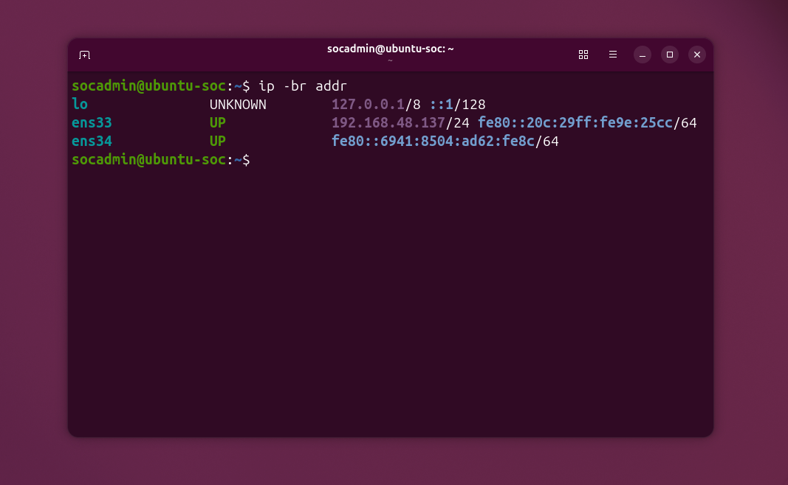

*Figure 1: Initial network configuration before assigning the Host-only static IP.*

---

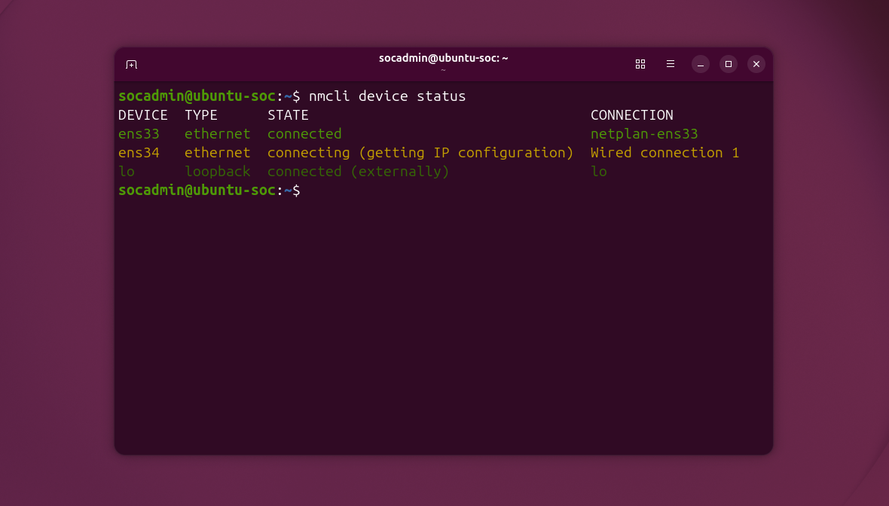

*Figure 2: NetworkManager connections available on Ubuntu before configuration.*

---

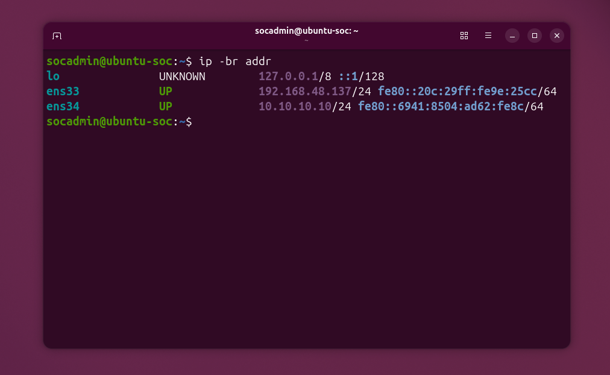

*Figure 3: Ubuntu Host-only interface configured with the static IP address 10.10.10.10/24.*

---

# Windows Network Configuration

Windows uses two Ethernet adapters.

| Adapter | Purpose | Configuration |
|----------|----------|---------------|
| Ethernet0 | NAT | DHCP |
| Ethernet1 | Host-only | Static |

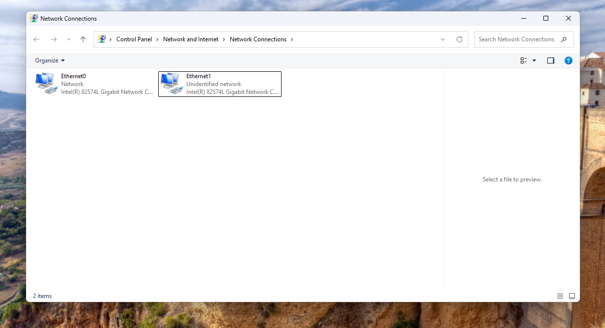

*Figure 4: Windows network adapters before configuration.*

---

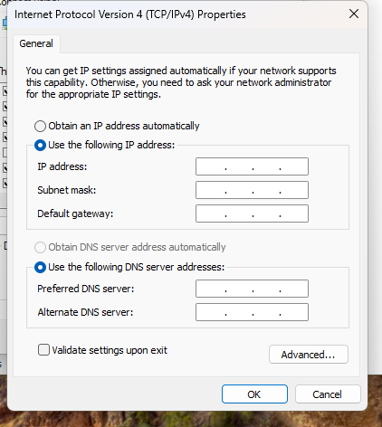

*Figure 5: Manual IPv4 configuration window.*

---

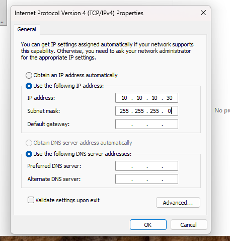

*Figure 6: Windows Host-only adapter configured with the static IP address 10.10.10.30/24.*

---

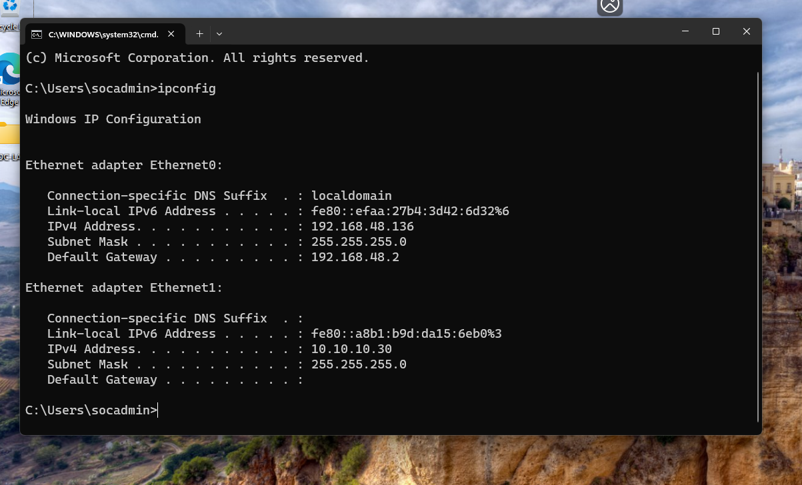

*Figure 7: Verification using the ipconfig command.*

---

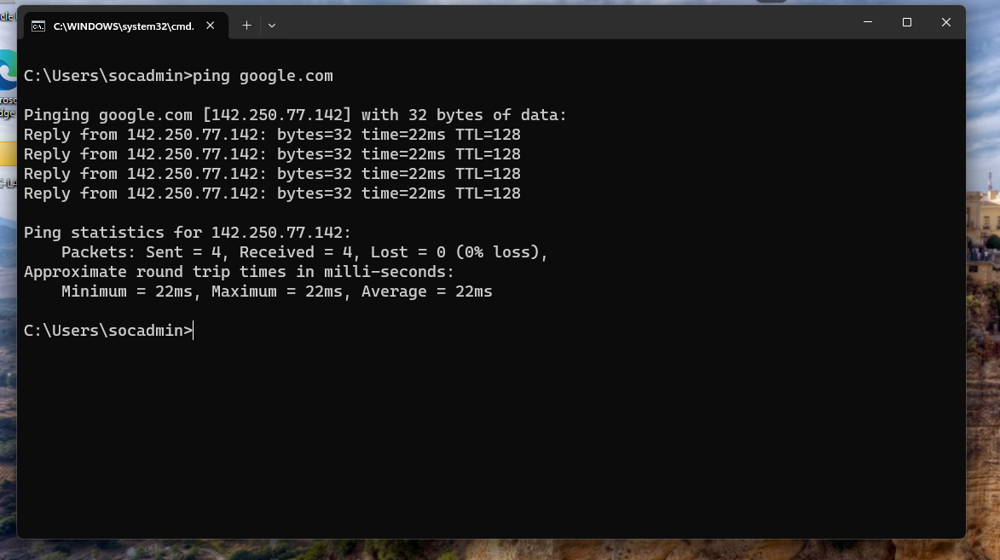

*Figure 8: Internet connectivity verified through the NAT adapter.*

---

# Kali Network Configuration

Kali Linux was configured as the attacker machine.

| Interface | Purpose | Configuration |
|-----------|----------|---------------|
| eth0 | NAT | DHCP |
| eth1 | Host-only | Static |

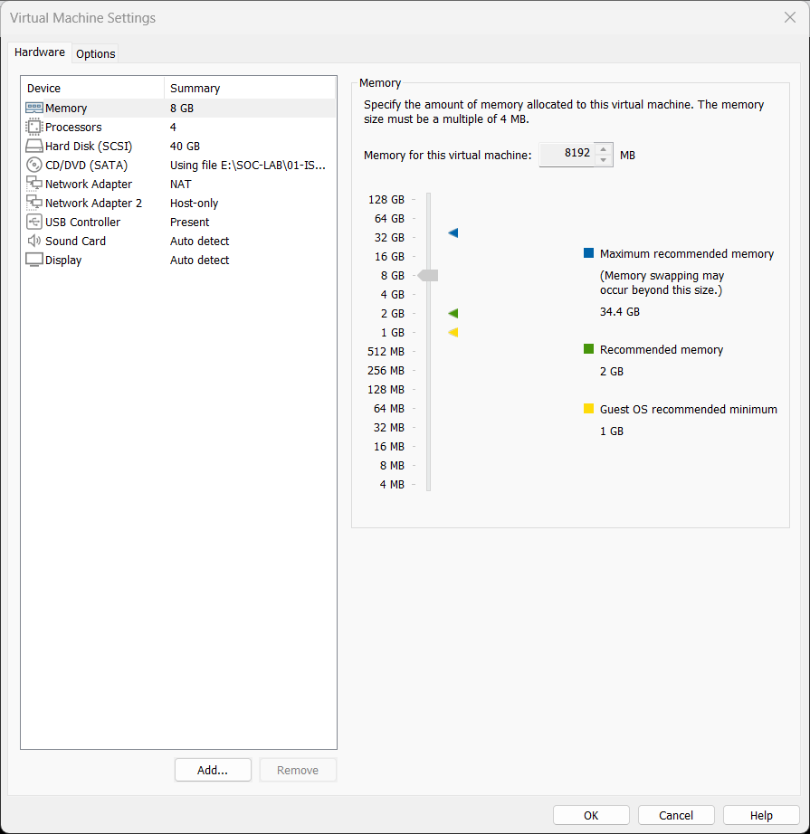

*Figure 9: Initial Kali network configuration.*

---

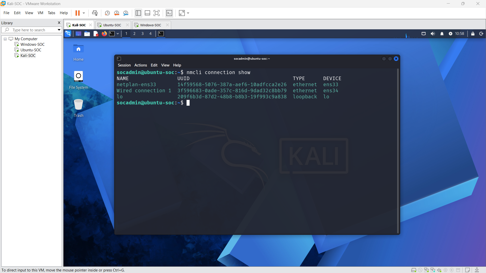

*Figure 9b: Kali network connections list before configuration.*

---

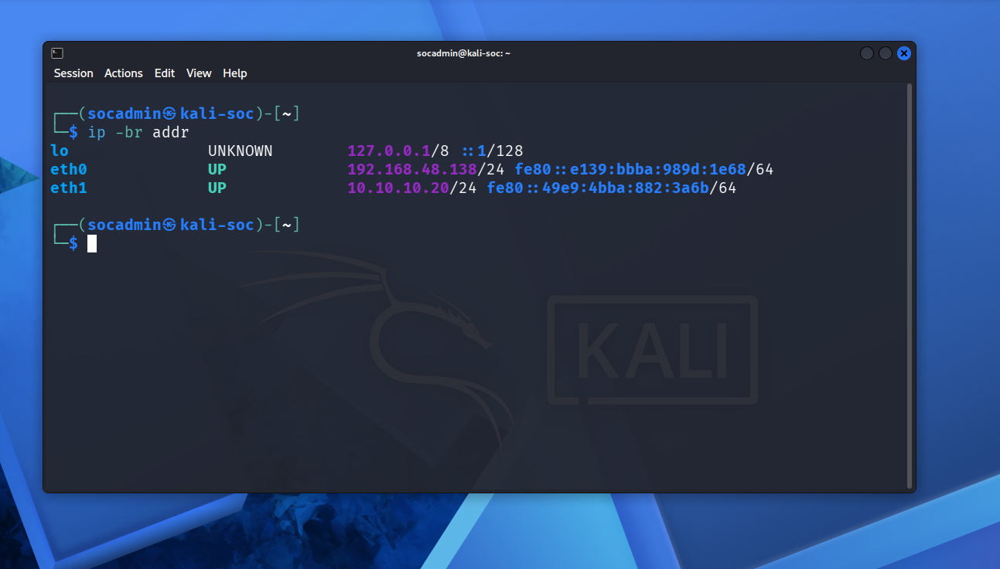

*Figure 10: Kali Host-only interface configured with the static IP address 10.10.10.20/24.*

---

# Connectivity Verification

The following connectivity tests were performed.

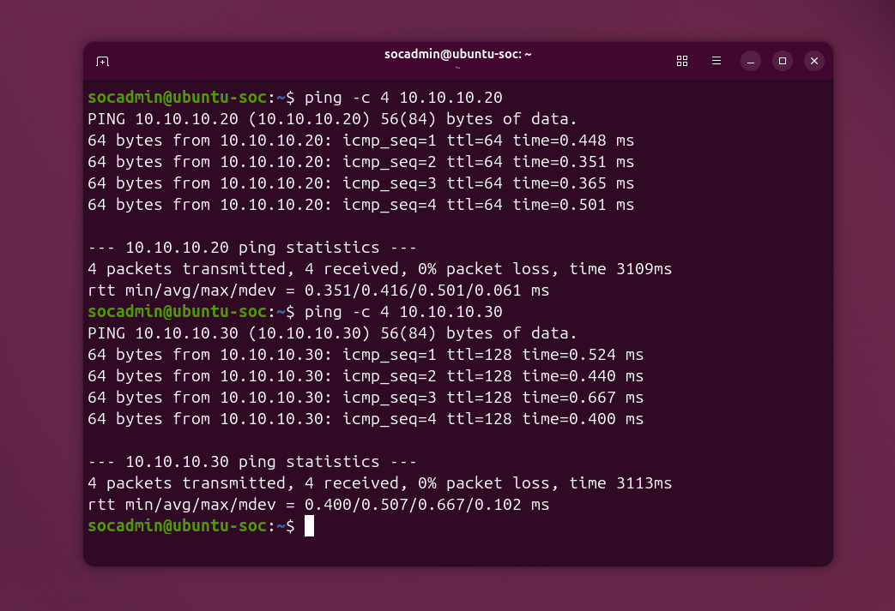

*Figure 11: Ubuntu successfully communicating with Windows and Kali.*

---

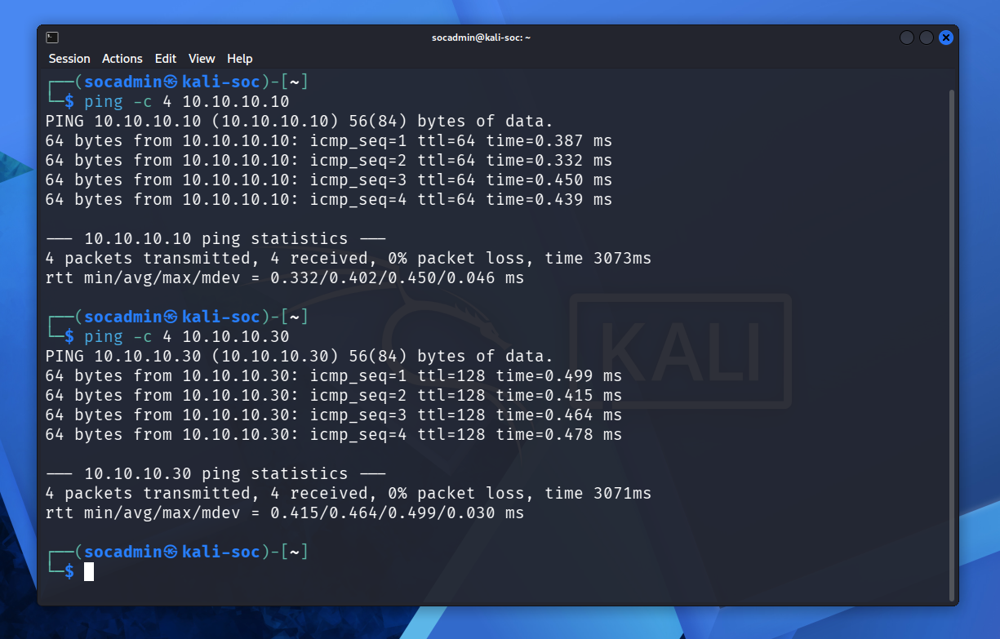

*Figure 12: Kali successfully communicating with Ubuntu and Windows.*

---

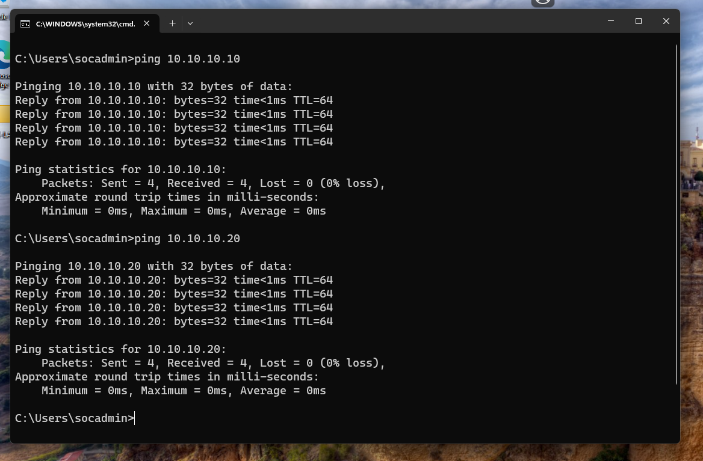

*Figure 13: Windows successfully communicating with Ubuntu and Kali.*

---

# OpenSSH Configuration

OpenSSH Server was installed on Ubuntu.

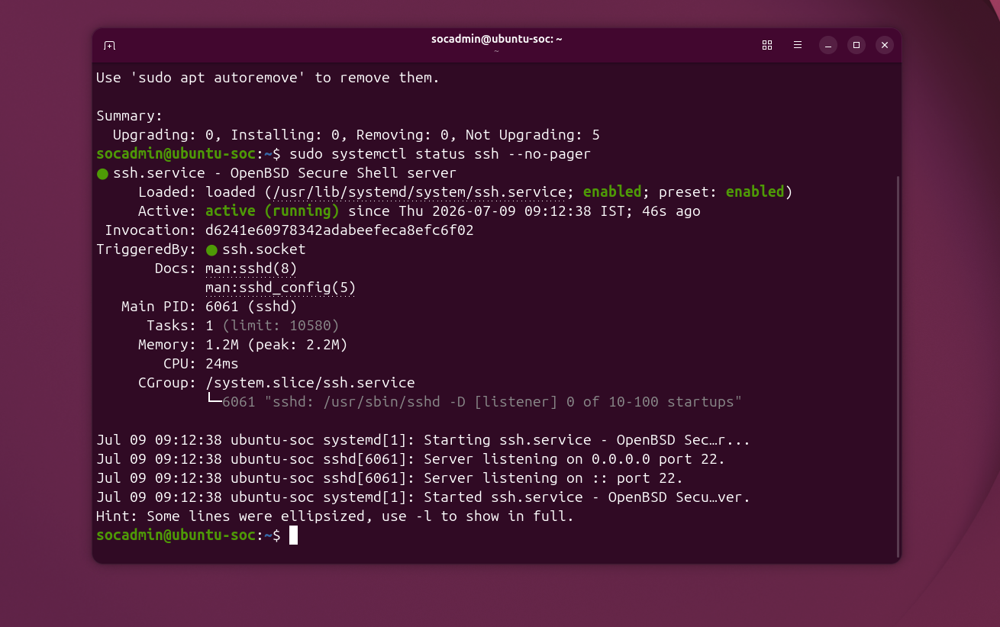

*Figure 14: OpenSSH Server running on Ubuntu.*

---

# SSH Verification

Remote administration was verified from Kali.

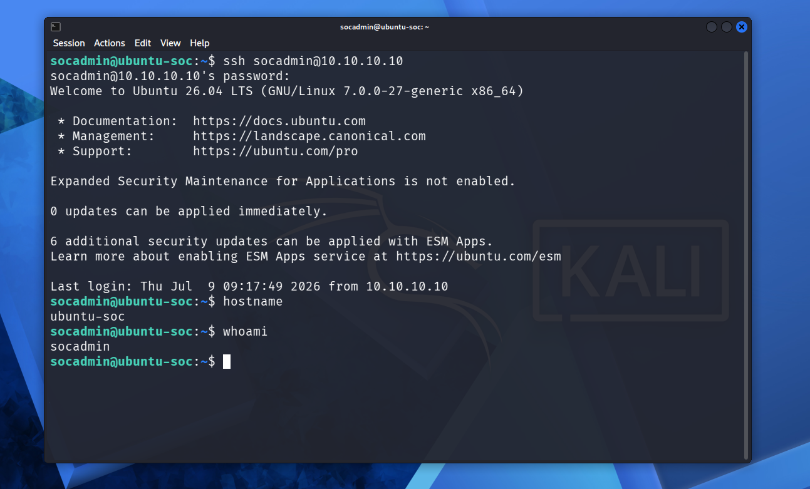

*Figure 15: Successful SSH login from Kali to Ubuntu.*

---

# Validation

| Validation | Status |
|------------|--------|
| Ubuntu Internet | ✅ |
| Windows Internet | ✅ |
| Kali Internet | ✅ |
| Ubuntu ↔ Windows | ✅ |
| Ubuntu ↔ Kali | ✅ |
| Windows ↔ Kali | ✅ |
| SSH Connection | ✅ |

---

# Tasks Completed

- VMware Host-only network configured
- Static IP assigned to Ubuntu
- Static IP assigned to Windows
- Static IP assigned to Kali
- Internet connectivity verified
- Internal SOC communication verified
- Windows Firewall configured for ICMP
- OpenSSH installed
- SSH connectivity verified
- Documentation screenshots captured

---

# Troubleshooting

## Issue 1 – Ubuntu and Kali could not ping Windows

### Problem

Ubuntu and Kali were unable to ping Windows, although Windows could successfully communicate with both Linux systems.

### Cause

Windows Defender Firewall blocks inbound ICMP Echo Requests by default.

### Resolution

Enabled the inbound firewall rule:

**File and Printer Sharing (Echo Request – ICMPv4-In)**

### Verification

Bidirectional ping tests were successful after enabling the rule.

---

## Issue 2 – Kali Network Interfaces Did Not Receive IP Addresses

### Problem

After installing Kali Linux, both `eth0` and `eth1` were detected but did not receive IPv4 addresses.

### Symptoms

```bash
ip -br addr
```

```
eth0    UP
eth1    UP
```

### Cause

NetworkManager did not automatically create Ethernet connection profiles.

### Resolution

Created separate NetworkManager connections.

**NAT**

```bash
sudo nmcli connection add type ethernet ifname eth0 con-name NAT
sudo nmcli connection modify NAT ipv4.method auto
sudo nmcli connection up NAT
```

**Host-only**

```bash
sudo nmcli connection add type ethernet ifname eth1 con-name SOC-LAB
sudo nmcli connection modify SOC-LAB \
ipv4.addresses 10.10.10.20/24 \
ipv4.method manual \
ipv4.gateway "" \
ipv4.dns ""
sudo nmcli connection up SOC-LAB
```

### Verification

```bash
ip -br addr
```

```
eth0    192.168.48.138/24
eth1    10.10.10.20/24
```

Both interfaces were successfully configured.

---

## Issue 3 – Ubuntu Host-only Interface Had No IP Address

### Problem

The Host-only interface remained unconfigured after installation.

### Cause

No static IP had been assigned.

### Resolution

Configured the interface using NetworkManager.

### Verification

Ubuntu became reachable from both Windows and Kali.

---

# Result

Phase 1 successfully established a fully functional internal SOC network. All virtual machines retained Internet connectivity through the NAT network while communicating securely over the isolated Host-only network. OpenSSH was configured to enable remote administration of the Ubuntu server, creating a stable foundation for deploying Splunk Enterprise and forwarding endpoint logs in the next phase.

---

# Phase Completion Checklist

- [x] VMware Host-only network configured
- [x] Ubuntu static IP configured
- [x] Windows static IP configured
- [x] Kali static IP configured
- [x] Internet connectivity verified
- [x] Inter-VM communication verified
- [x] OpenSSH installed
- [x] SSH connectivity verified
- [x] Documentation completed
- [x] VMware snapshots created

---

# Next Phase

## Phase 2 – Splunk Enterprise Installation

The next phase will focus on deploying Splunk Enterprise on Ubuntu-SOC, configuring the Splunk Web interface, enabling automatic startup, creating indexes, configuring the receiving port (9997), and preparing the environment for Windows log forwarding using the Splunk Universal Forwarder.