# Phase 2 – Splunk Enterprise Installation & Initial Configuration

---

# Objective

The objective of this phase was to deploy and configure Splunk Enterprise as the centralized Security Information and Event Management (SIEM) platform for the SOC Home Lab. This included installing Splunk Enterprise, performing the initial setup, enabling automatic startup, configuring network services, and preparing the server to receive logs from Windows and Linux endpoints.

---

# Architecture

```
                    SOC HOME LAB

                ┌──────────────────┐
                │  Windows-SOC     │
                │  Universal FW     │
                └─────────┬────────┘
                          │
                          │ TCP 9997
                          │
                ┌─────────▼────────┐
                │                  │
                │ Ubuntu-SOC       │
                │ Splunk Enterprise│
                │                  │
                └─────────┬────────┘
                          │
          Web Interface : TCP 8000
          Management    : TCP 8089
```

---

# Splunk Enterprise

| Component | Value |
|----------|-------|
| Version | Splunk Enterprise 10.4.1 |
| Operating System | Ubuntu 24.04.2 LTS Desktop |
| Installation Method | Debian Package (.deb) |
| Installation Directory | /opt/splunk |
| Web Interface | Port 8000 |
| Management Port | Port 8089 |
| Receiving Port | Port 9997 |

---

# Installation

The Splunk Enterprise installation package was downloaded from the official Splunk website and stored inside the project directory before deployment.

```
SOC-LAB/
└──03-Splunk
    └──Enterprise
        └──splunk-10.4.1-5a009d941268-linux-amd64.deb
```

---

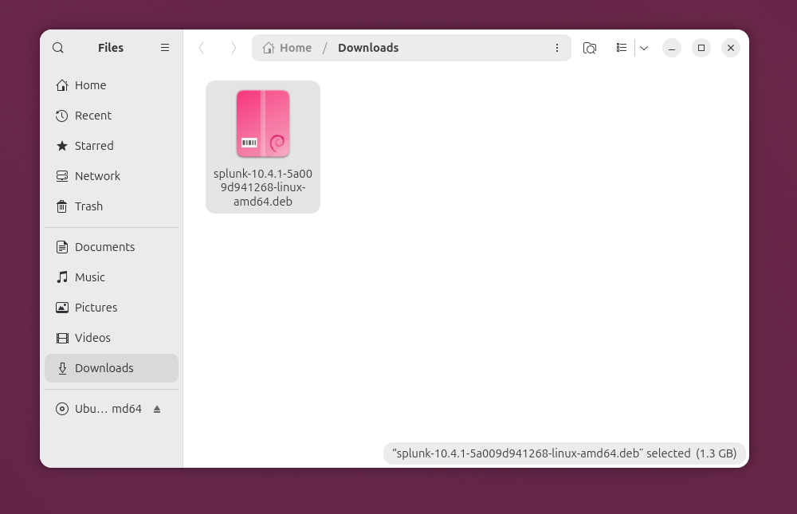

*Figure 1: Splunk Enterprise Debian installation package downloaded successfully.*

---

The installation package was moved into the project repository for long-term storage and version management.

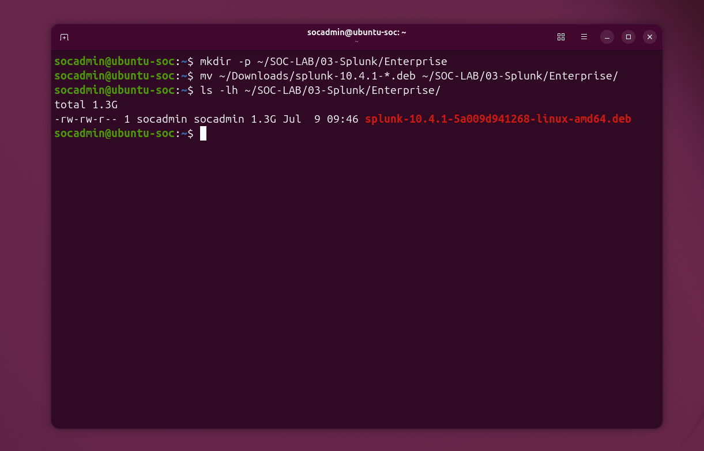

*Figure 2: Verification that the Splunk Enterprise installation package was stored in the project directory before deployment.*

---

Splunk Enterprise was installed using the Debian package manager.

Installation Command

```bash
sudo dpkg -i splunk-10.4.1-5a009d941268-linux-amd64.deb
```

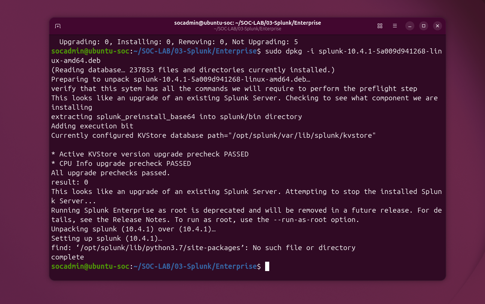

*Figure 3: Successful installation of Splunk Enterprise using the Debian package manager.*

---

# Initial Startup

During the first startup:

- Splunk license accepted
- Administrator account created
- SSL certificates generated
- Splunk services initialized
- Web server started

The Splunk Web interface became available at:

```
http://10.10.10.10:8000
```

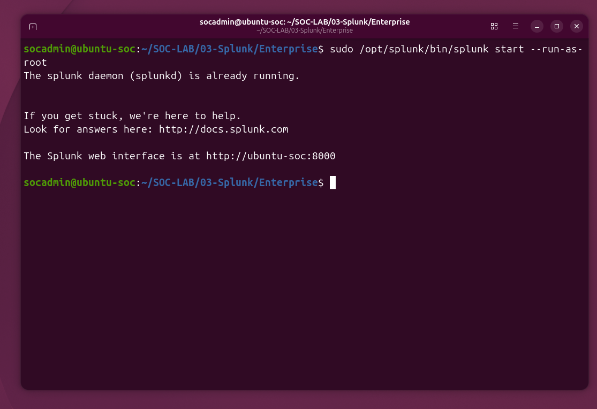

*Figure 4: Successful first-time initialization of Splunk Enterprise and activation of the Splunk Web interface.*

---

# Service Verification

The Splunk service status was verified after installation.

Verification Command

```bash
sudo /opt/splunk/bin/splunk status
```

Result

- splunkd running
- helper services running

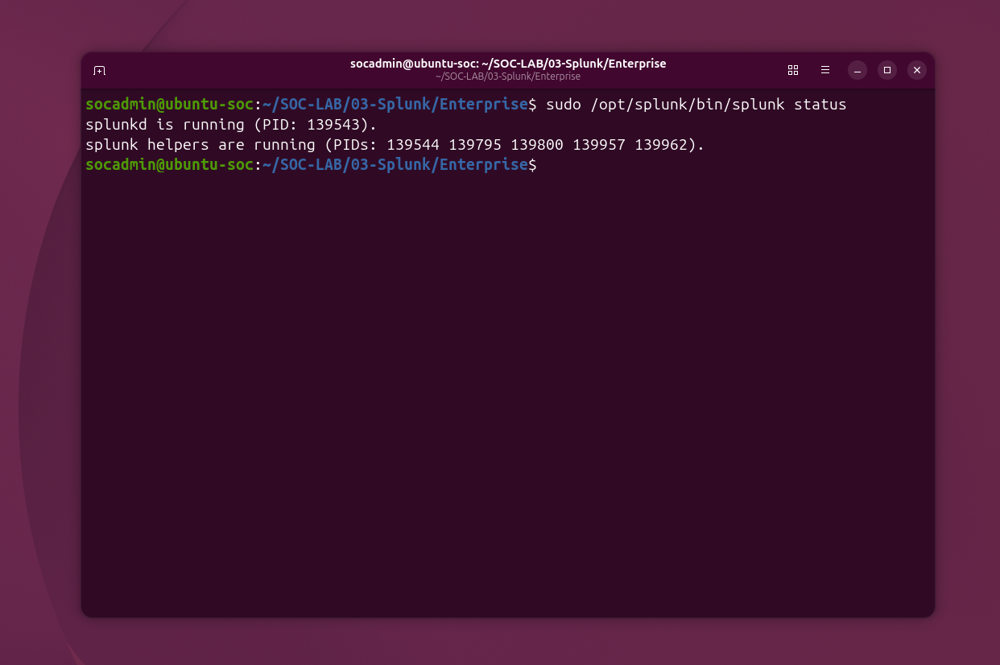

*Figure 5: Verification that all Splunk Enterprise services are running successfully.*

---

# Boot Configuration

Splunk was configured to automatically start whenever Ubuntu boots.

Command

```bash
sudo /opt/splunk/bin/splunk enable boot-start
```

Result

- Init script installed
- Automatic startup enabled

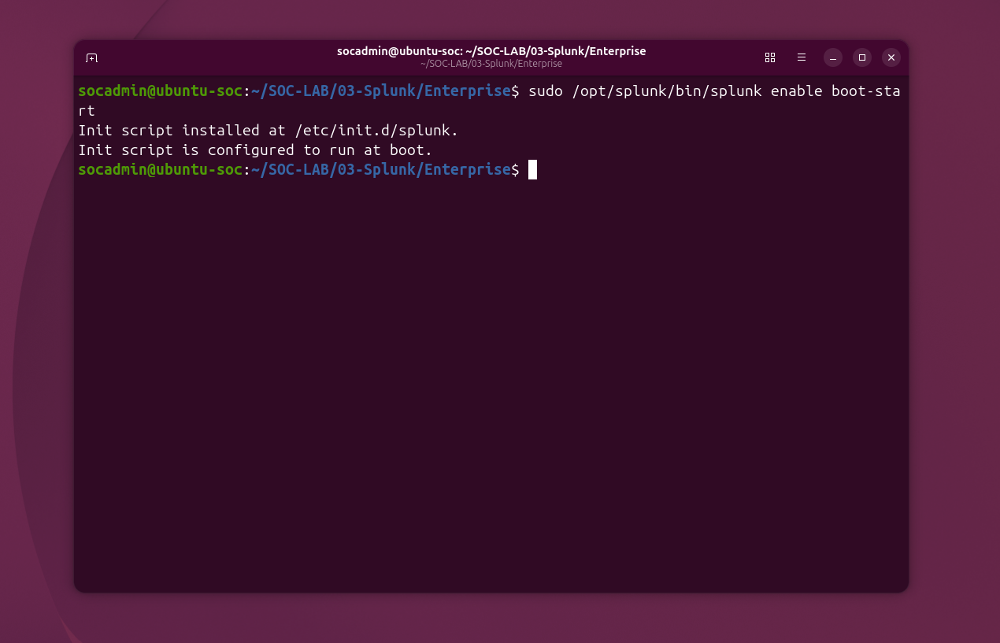

*Figure 6: Splunk Enterprise configured to start automatically during system boot.*

---

# Network Services

Listening ports were verified to ensure that Splunk services were available.

Verification Command

```bash
sudo ss -lntp | grep splunk
```

Verified Ports

| Port | Purpose |
|------|----------|
| 8000 | Splunk Web Interface |
| 8089 | Management Port |

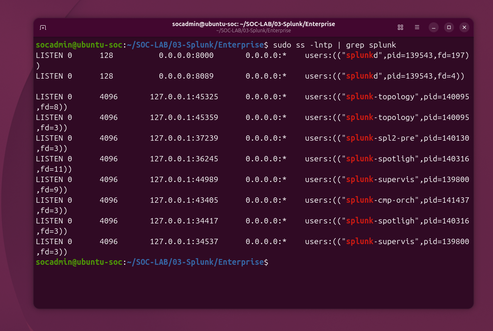

*Figure 7: Verification of active Splunk Enterprise network services.*

---

# Splunk Web Interface

The Splunk dashboard was accessed successfully using the administrator account.

URL

```
http://10.10.10.10:8000
```

Administrator Account

```
Username : splunkadmin
Password : ********
```

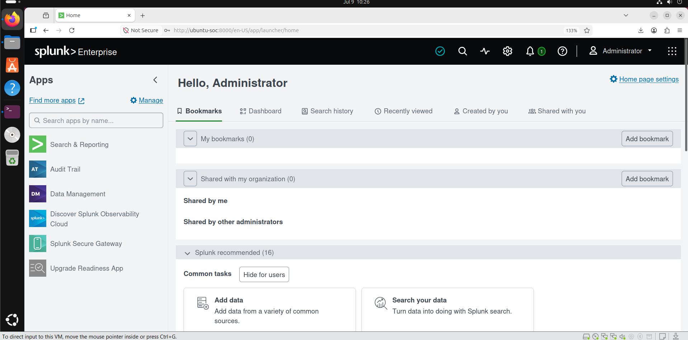

*Figure 8: Successful login to the Splunk Enterprise dashboard.*

---

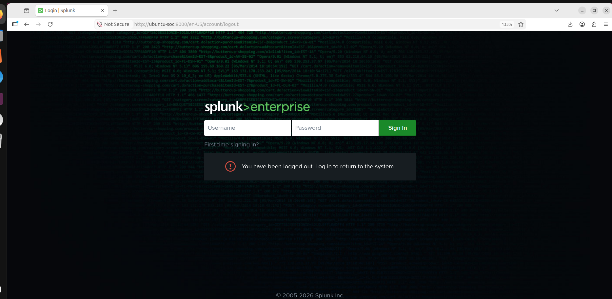

*Figure 9: Splunk Enterprise login page after administrator logout.*

---

# Receiving Port Configuration

To receive data from Universal Forwarders, Splunk was configured to listen on TCP port **9997**.

Receiving Port

```
9997/TCP
```

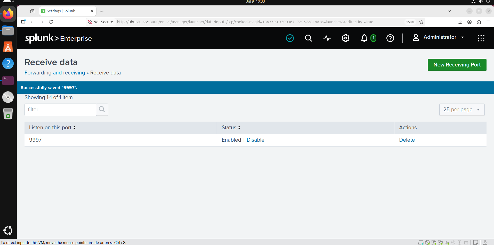

*Figure 9b: Configuring the receiving port (9997) in Splunk Web.*

---

# Custom Indexes

To organize endpoint logs efficiently, dedicated indexes were created.

| Index | Purpose |
|--------|----------|
| windows | Windows Event Logs |
| sysmon | Microsoft Sysmon Logs |
| linux | Linux System Logs |
| security | Security Related Events |

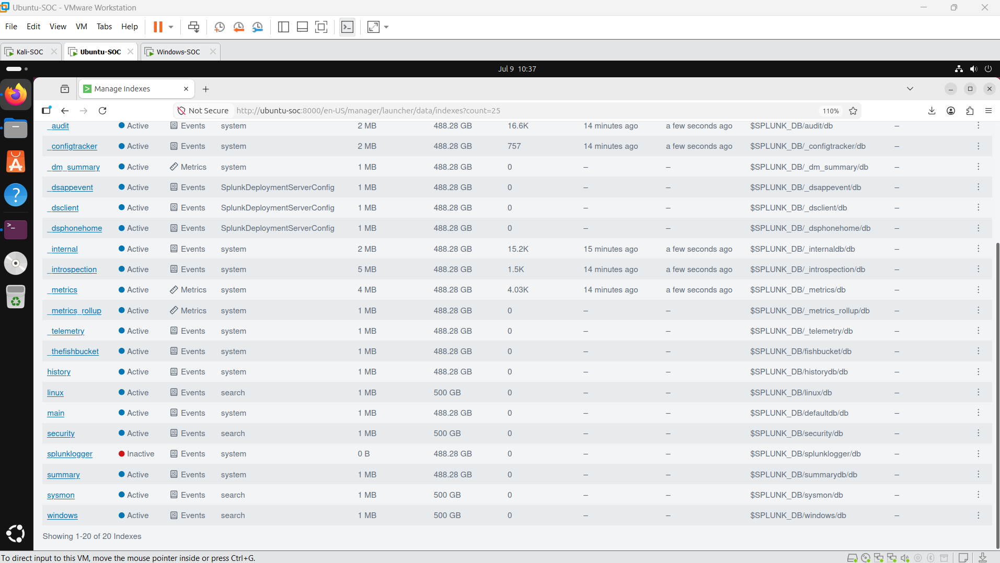

*Figure 10: Custom indexes created for organizing endpoint and security event data.*

---

# Receiving Port Verification

The receiving port was verified using the Linux socket utility.

Verification Command

```bash
sudo ss -lntp | grep 9997
```

Result

```
0.0.0.0:9997
```

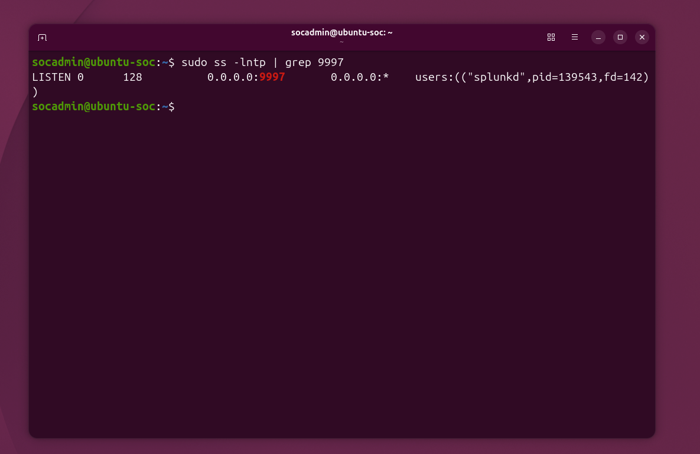

*Figure 11: Verification that Splunk Enterprise is actively listening on TCP port 9997.*

---

# Final Configuration

| Feature | Status |
|----------|--------|
| Splunk Installed | ✅ |
| Administrator Account Created | ✅ |
| Web Interface Available | ✅ |
| Boot Start Enabled | ✅ |
| Port 8000 Configured | ✅ |
| Port 8089 Configured | ✅ |
| Port 9997 Configured | ✅ |
| Windows Index Created | ✅ |
| Sysmon Index Created | ✅ |
| Linux Index Created | ✅ |
| Security Index Created | ✅ |

---

# Tasks Completed

- ✅ Downloaded Splunk Enterprise
- ✅ Organized installation files
- ✅ Installed Splunk Enterprise
- ✅ Accepted Splunk license
- ✅ Created administrator account
- ✅ Started Splunk services
- ✅ Verified Splunk status
- ✅ Enabled automatic startup
- ✅ Verified listening ports
- ✅ Logged into Splunk Web
- ✅ Configured receiving port (9997)
- ✅ Created custom indexes
- ✅ Verified receiving port

---

# Result

A fully operational Splunk Enterprise SIEM server was successfully deployed on the Ubuntu-SOC virtual machine. The server is configured to receive endpoint telemetry through TCP port **9997**, provides web-based administration on port **8000**, and includes dedicated indexes for Windows, Sysmon, Linux, and Security event data. The platform is now ready for endpoint integration and log ingestion.

---

# Next Phase

## Phase 3 – Windows Endpoint Integration

The next phase includes:

- Install Splunk Universal Forwarder
- Install Microsoft Sysmon
- Configure Windows Event Forwarding
- Configure Universal Forwarder outputs
- Configure inputs
- Forward Windows logs to Splunk
- Forward Sysmon logs to Splunk
- Verify event ingestion
- Build initial Splunk searches and dashboards

---