# Phase 3 – Windows Logging with Splunk Universal Forwarder and Sysmon

## Objective

The objective of this phase was to configure the Windows endpoint to send Windows Event Logs and Sysmon telemetry to the Splunk Enterprise server. Splunk Universal Forwarder was installed, configured to communicate with the Splunk receiving indexer, and Sysmon was deployed to generate detailed endpoint telemetry for threat hunting and detection engineering.

---

# Architecture

```
                Windows-SOC
        +-------------------------+
        | Splunk Universal Forwarder |
        | Sysmon                  |
        +------------+------------+
                     |
                     | TCP 9997
                     |
                     v
        +-------------------------+
        | Ubuntu-SOC              |
        | Splunk Enterprise       |
        | Receiving Indexer       |
        +-------------------------+
```

---

# Lab Environment

| Component | Value |
|-----------|-------|
| Windows Endpoint | Windows 11 Pro |
| Splunk Enterprise | Ubuntu-SOC |
| Splunk Universal Forwarder | 10.4.1 |
| Sysmon | Sysinternals Sysmon v15.x |
| Communication Port | TCP 9997 |
| Deployment Server | TCP 8089 |
| Ubuntu IP | 10.10.10.10 |
| Windows IP | 10.10.10.30 |

---

# Step 1 – Verify Connectivity

Before installing the Universal Forwarder, connectivity to the Splunk receiving port was verified.

Command:

```powershell
Test-NetConnection 10.10.10.10 -Port 9997
```

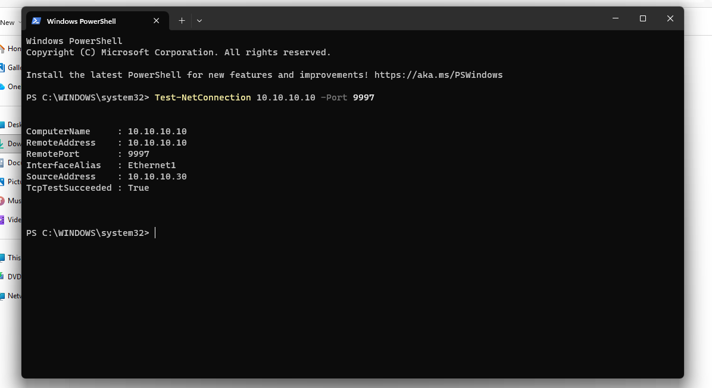

*Figure 1: Successful TCP connectivity from Windows-SOC to the Splunk receiving indexer.*

---

# Step 2 – Configure Windows Event Collection

During installation, the following Windows Event Logs were enabled:

- Application
- Security
- System
- Forwarded Events
- Setup

Performance monitoring and Active Directory monitoring were not enabled.

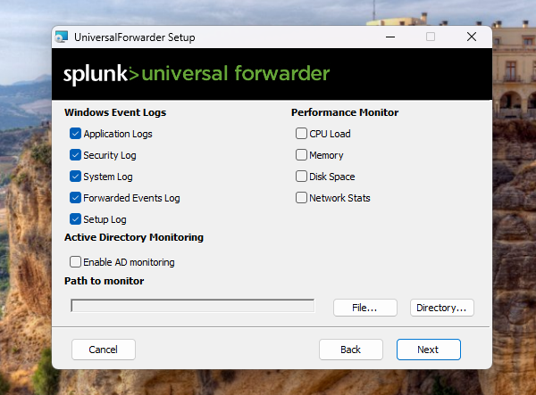

*Figure 2: Windows Event Log selection during Universal Forwarder installation.*

---

# Step 3 – Configure Universal Forwarder Administrator

A dedicated administrator account was created.

Username:

```
splunkadmin
```

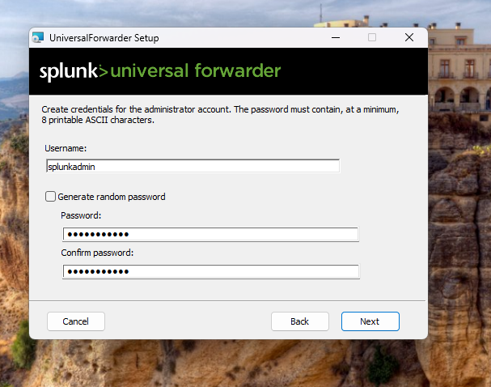

*Figure 3: Universal Forwarder administrator account configuration.*

---

# Step 4 – Configure Deployment Server

Deployment Server Configuration

| Setting | Value |
|----------|-------|
| Host | 10.10.10.10 |
| Port | 8089 |

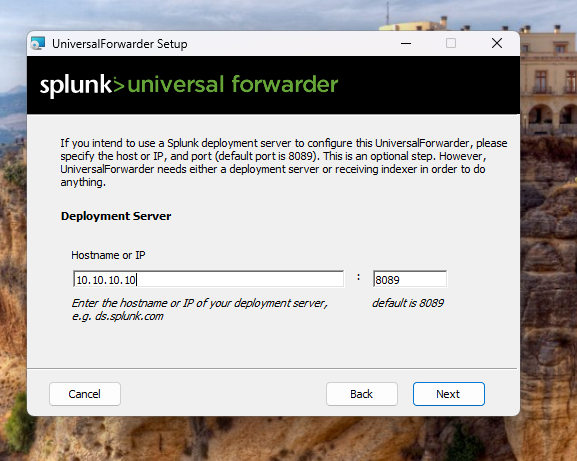

*Figure 4: Deployment server configuration.*

---

# Step 5 – Configure Receiving Indexer

Receiving Indexer Configuration

| Setting | Value |
|----------|-------|
| Host | 10.10.10.10 |
| Port | 9997 |

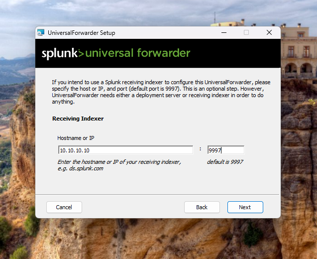

*Figure 5: Receiving indexer configuration.*

---

# Step 6 – Complete Universal Forwarder Installation

The installation completed successfully.

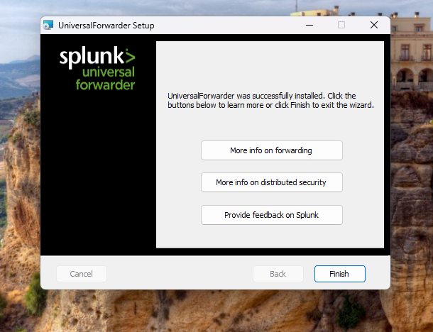

*Figure 6: Successful Universal Forwarder installation.*

---

# Step 7 – Verify Splunk Forwarder Service

PowerShell

```powershell
Get-Service SplunkForwarder
```

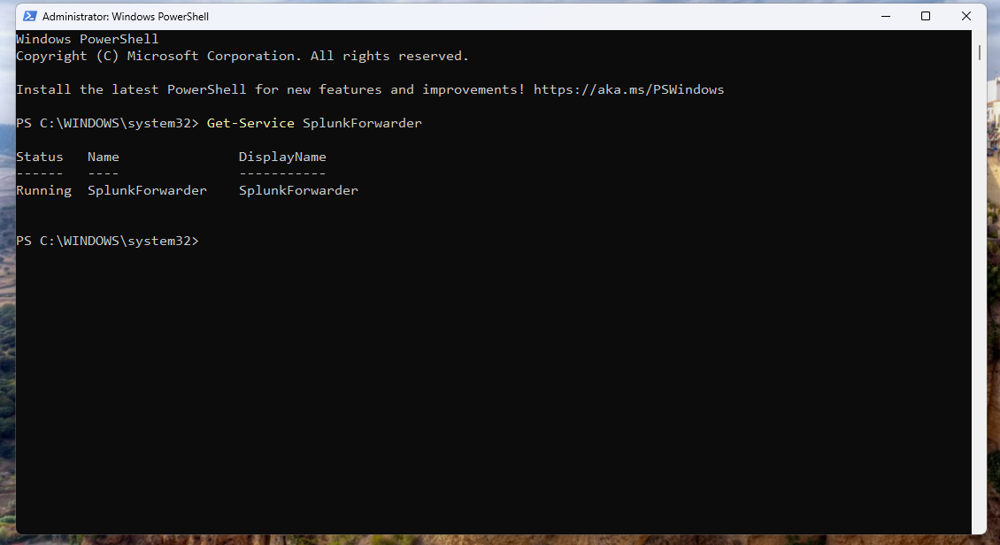

*Figure 7: Splunk Universal Forwarder service running.*

---

# Step 8 – Verify Forward Server

Command

```powershell
.\splunk.exe list forward-server
```

Result

```
10.10.10.10:9997
```

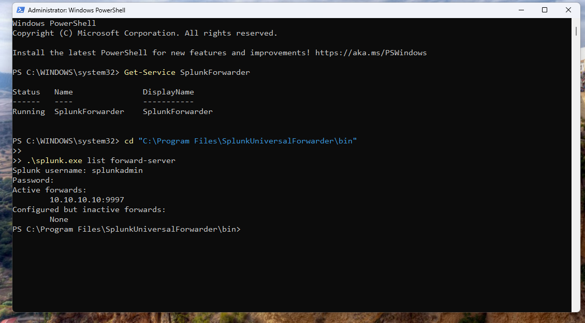

*Figure 8: Forward server successfully configured.*

---

# Step 9 – Verify Deployment Server

Command

```powershell
.\splunk.exe list deploy-poll
```

Result

```
Deployment Server URI:
10.10.10.10:8089
```

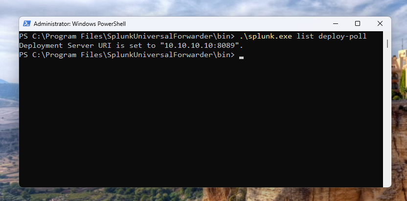

*Figure 9: Deployment server successfully configured.*

---

# Step 10 – Verify Universal Forwarder Inputs

Command

```powershell
.\splunk.exe btool inputs list --debug
```

The configured Windows Event Logs were successfully loaded.

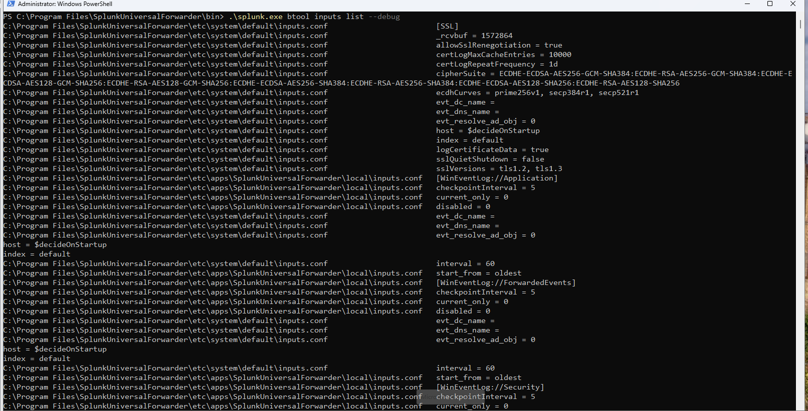

*Figure 10: Universal Forwarder inputs configuration.*

---

# Step 11 – Prepare Sysmon Installation

Downloaded files

- Sysmon64.exe
- Sysmon configuration XML

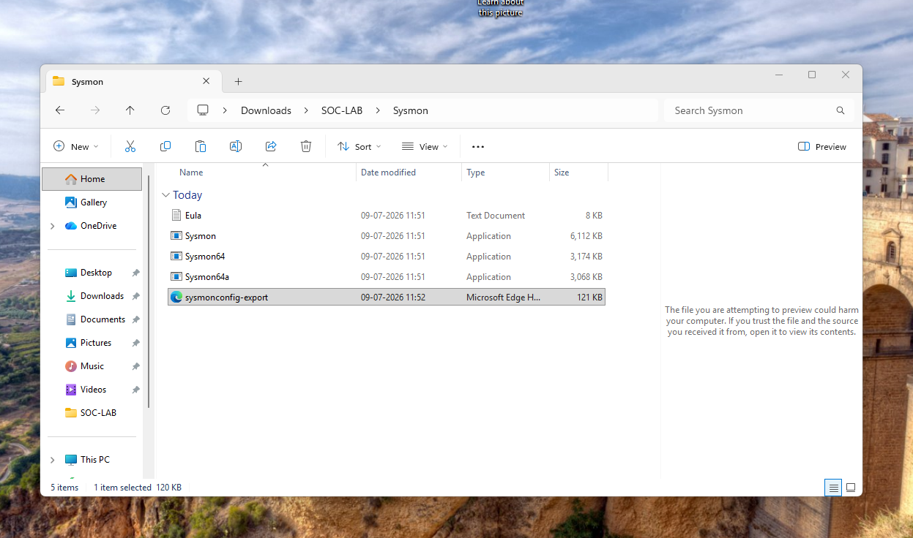

*Figure 11: Sysmon installation files.*

---

# Step 12 – Install Sysmon

Command

```cmd
Sysmon64.exe -accepteula -i sysmonconfig-export.xml
```

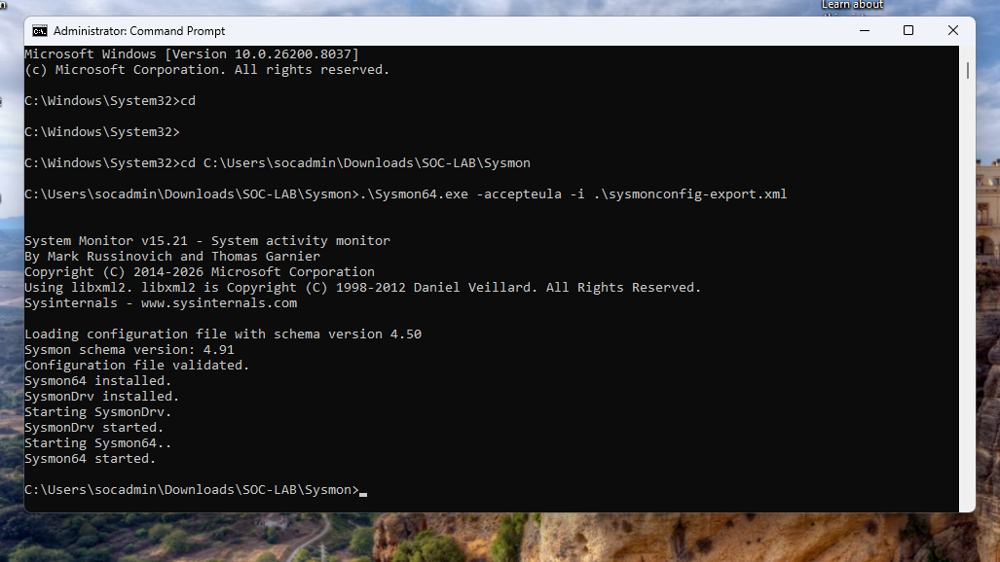

*Figure 12: Successful Sysmon installation.*

---

# Step 13 – Verify Sysmon Service

Command

```powershell
Get-Service Sysmon64
```

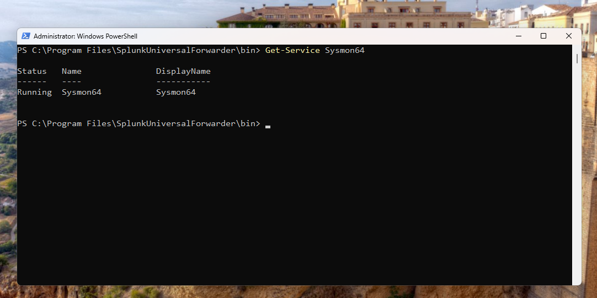

*Figure 13: Sysmon service running.*

---

# Step 14 – Verify Sysmon Event Logs

Command

```powershell
Get-WinEvent -LogName "Microsoft-Windows-Sysmon/Operational" -MaxEvents 10
```

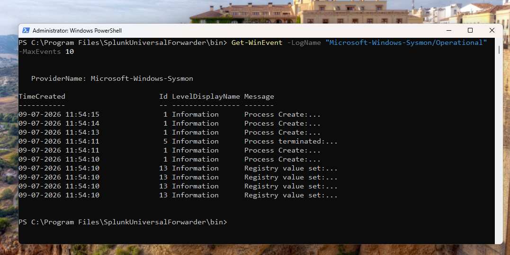

*Figure 14: Sysmon generating Windows Event Logs.*

---

# Step 15 – Verify Sysmon Configuration

Command

```cmd
sysmon64 -c
```

This confirms the active configuration, hashing algorithms, process creation rules, registry monitoring, and network monitoring.

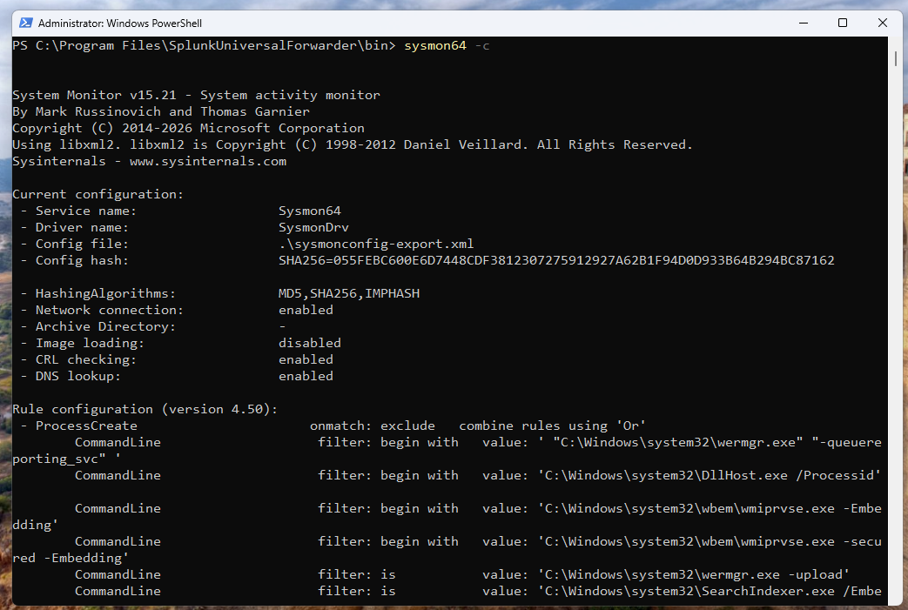

*Figure 15: Active Sysmon configuration.*

---

# Step 16 – Configure Sysmon Input

Created

```
inputs.conf
```

Contents

```ini
[WinEventLog://Microsoft-Windows-Sysmon/Operational]
disabled = 0
start_from = oldest
current_only = 0
renderXml = true
index = sysmon
```

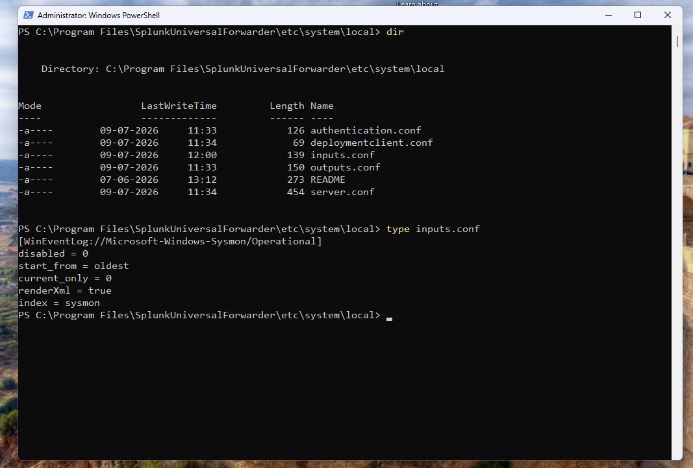

*Figure 16: Sysmon input configuration.*

---

# Step 17 – Restart Universal Forwarder

Command

```powershell
.\splunk.exe restart
```

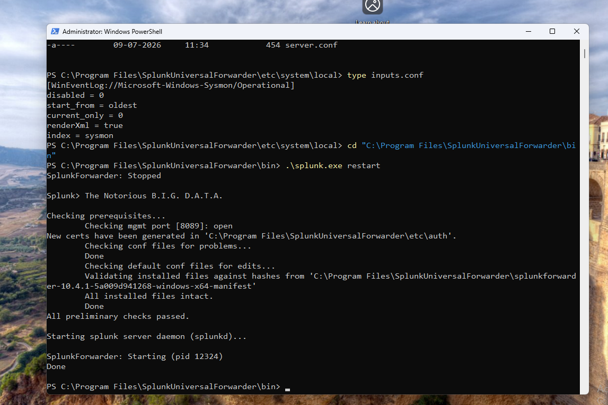

*Figure 17: Restarting the Universal Forwarder.*

---

# Step 18 – Verify Sysmon Input Registration

Command

```powershell
.\splunk.exe btool inputs list --debug | findstr /i Sysmon
```

The Universal Forwarder successfully loaded the Sysmon input configuration.

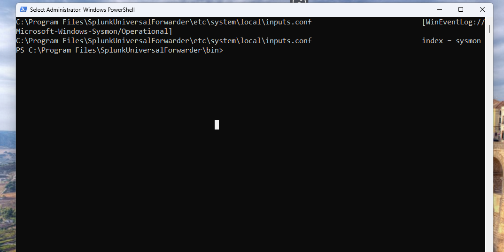

*Figure 18: Verification of Sysmon input registration.*

---

# Step 19 – Verify Sysmon Events in Splunk

Search

```
index=sysmon
```

Result

Sysmon events were successfully received by Splunk Enterprise.

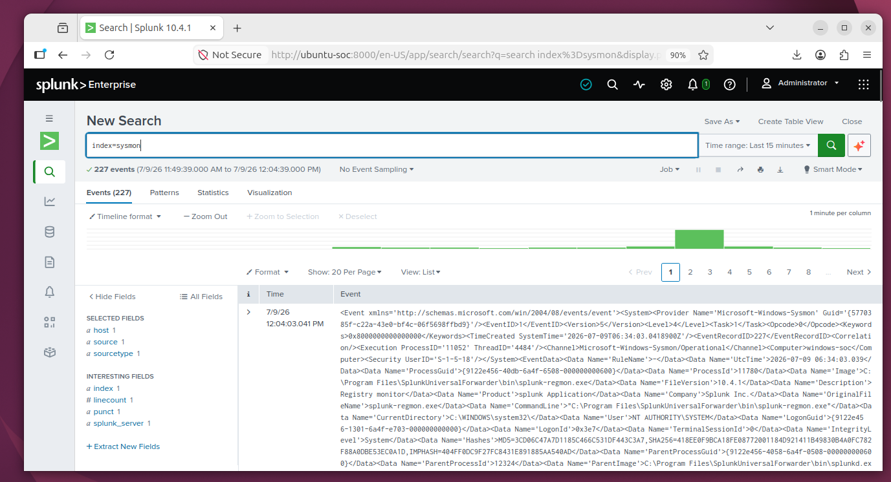

*Figure 19: Sysmon events successfully indexed by Splunk Enterprise.*

---

# Tasks Completed

- ✅ Installed Splunk Universal Forwarder
- ✅ Configured Windows Event Log forwarding
- ✅ Configured Deployment Server
- ✅ Configured Receiving Indexer
- ✅ Verified connectivity to Splunk
- ✅ Installed Sysmon
- ✅ Verified Sysmon service
- ✅ Configured Sysmon log forwarding
- ✅ Verified Universal Forwarder inputs
- ✅ Successfully forwarded Sysmon events to Splunk Enterprise

---

# Verification

The following components were successfully verified:

- ✅ Splunk Universal Forwarder service running
- ✅ Windows Event Logs forwarding
- ✅ Deployment Server connectivity
- ✅ Receiving Indexer connectivity
- ✅ Sysmon installed successfully
- ✅ Sysmon Operational Log generated
- ✅ Sysmon configuration active
- ✅ Sysmon events indexed in Splunk

---

# Result

Phase 3 successfully integrated the Windows endpoint with the Splunk Enterprise server. Windows Event Logs and Sysmon telemetry are now continuously forwarded to Splunk, providing high-quality endpoint visibility required for threat detection, incident response, and security monitoring.

---

# Next Phase

## Phase 4 – Attack Simulation

The next phase will focus on generating realistic attack telemetry using Kali Linux. Activities will include:

- Nmap reconnaissance
- SSH brute-force attacks
- Hydra password attacks
- Metasploit exploitation
- Reverse shell execution
- Privilege escalation
- Persistence techniques
- Detection and analysis of attack artifacts in Splunk