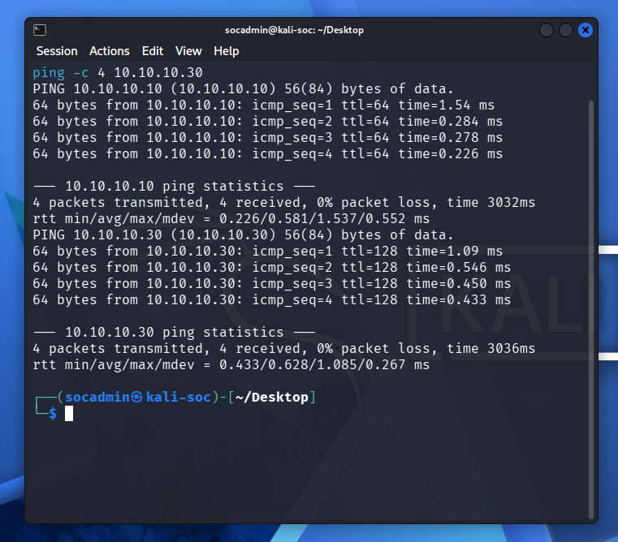
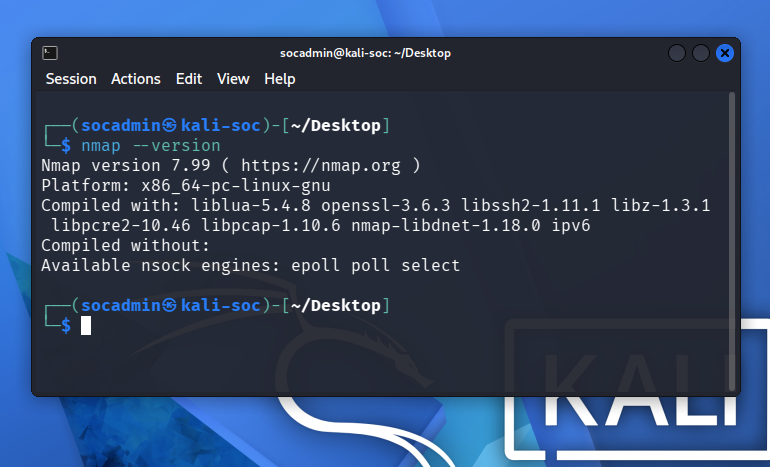
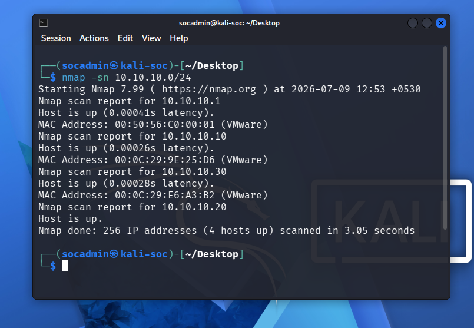
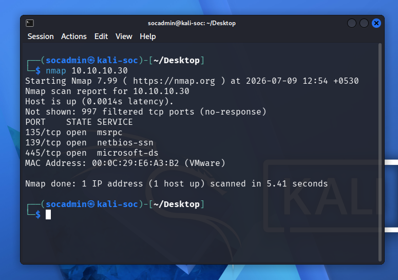
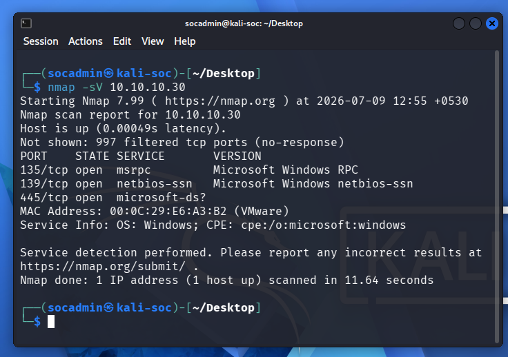
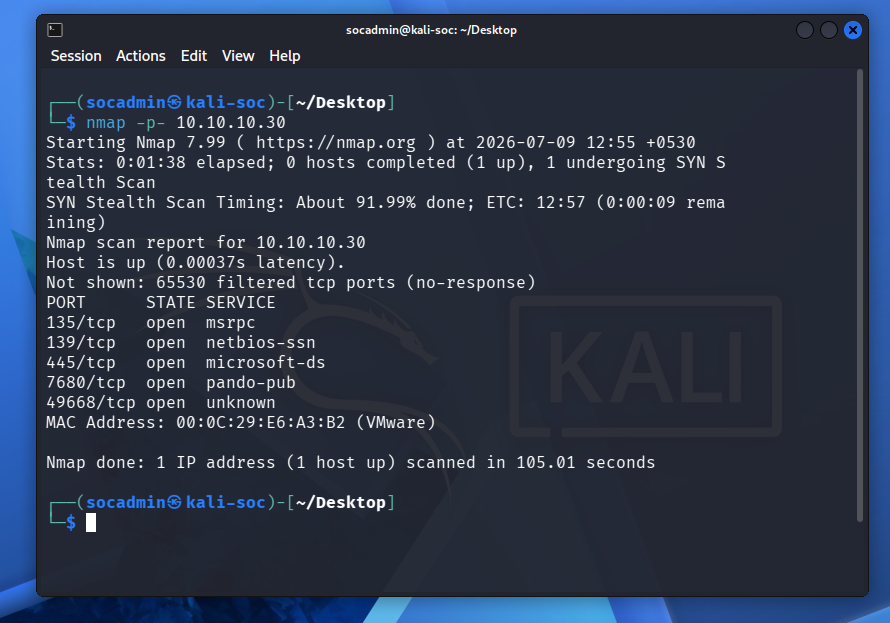
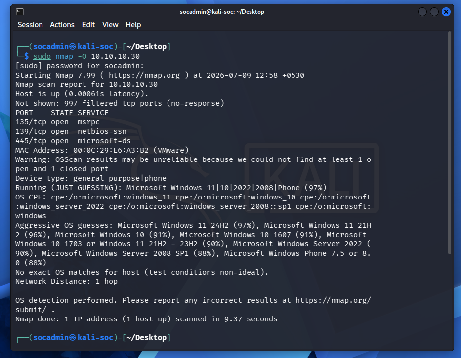
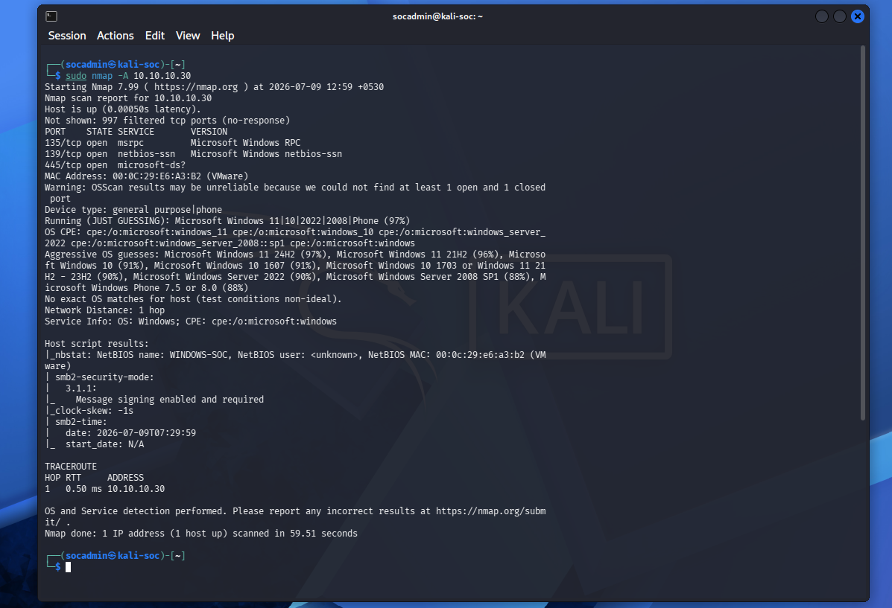

PHASE 4 – Kali Linux Setup & Network Reconnaissance

Project: Enterprise SOC Home Lab – Attack & Defense Simulation

Objective

The objective of Phase 4 was to prepare the attacker workstation (Kali Linux), verify connectivity across the SOC lab network, and perform reconnaissance against the Windows endpoint using Nmap.

This phase establishes the offensive security component of the lab and provides baseline reconnaissance data before attack simulation begins.

Learning Objectives
Configure Kali Linux
Verify SOC-LAB network connectivity
Understand host discovery techniques
Perform TCP port scanning
Detect running services
Perform operating system fingerprinting
Collect reconnaissance information
Prepare attacker machine for later attack simulation
Lab Architecture
                 +----------------------+
                 |      Kali Linux      |
                 |     10.10.10.20      |
                 |   Attacker Machine   |
                 +----------+-----------+
                            |
                            |
                     SOC-LAB Network
                       10.10.10.0/24
                            |
        ---------------------------------------------
        |                                           |
        |                                           |
+-------+--------+                        +----------+---------+
| Ubuntu SOC     |                        | Windows Endpoint   |
| 10.10.10.10    |                        | 10.10.10.30        |
| Splunk Server  |                        | Victim Machine     |
+----------------+                        +--------------------+
Software Used
Software	Version	Purpose
Kali Linux	Latest	Attacker Machine
Nmap	7.99	Network Reconnaissance
VMware Workstation Pro	Latest	Virtualization
Network Configuration
Machine	IP Address
Ubuntu SOC	10.10.10.10
Kali Linux	10.10.10.20
Windows Endpoint	10.10.10.30
Tasks Performed
1. Verified Connectivity

Verified communication between Kali and the lab machines.

Command:

```bash
ping -c 4 10.10.10.10
```

Result

Success

Command

```bash
ping -c 4 10.10.10.30
```

Result

Success



*Figure 1: Bidirectional ping scans verifying Kali connectivity to the Windows endpoint and Ubuntu SOC server.*
2. Verified Nmap Installation

Command

nmap --version

Verified

Nmap installed
Version 7.99



*Figure 2: Verifying that Nmap is installed and configured on the Kali attacker platform.*
3. Host Discovery

Performed ICMP sweep of the SOC network.

Command

nmap -sn 10.10.10.0/24

Discovered Hosts

IP	Description
10.10.10.1	VMware Gateway
10.10.10.10	Ubuntu SOC
10.10.10.20	Kali Linux
10.10.10.30	Windows Endpoint



*Figure 3: Nmap Host Discovery scan output identifying all active network interfaces.*
4. TCP Port Scan

Performed a default TCP scan against the Windows endpoint.

Command

nmap 10.10.10.30

Open Ports

Port	Service
135	MSRPC
139	NetBIOS
445	SMB



*Figure 4: Nmap default TCP port scan against the target Windows VM, discovering ports 135, 139, and 445.*
5. Service Detection

Performed version detection.

Command

nmap -sV 10.10.10.30

Detected Services

Port	Service
135	Microsoft RPC
139	NetBIOS
445	Microsoft SMB



*Figure 5: Nmap service version detection (-sV) identifying RPC and SMB.*
6. Full TCP Scan

Scanned all TCP ports.

Command

nmap -p- 10.10.10.30

Additional Ports

Port	Service
7680	Windows Delivery Optimization
49668	Dynamic RPC



*Figure 6: Complete TCP port scanning across all 65,535 ports against the target Windows machine.*
7. Operating System Detection

Performed OS fingerprinting.

Command

sudo nmap -O 10.10.10.30

Result

Microsoft Windows 11 detected



*Figure 7: Nmap OS detection scans accurately identifying the victim system as Windows 11.*
8. Aggressive Scan

Performed comprehensive reconnaissance.

Command

sudo nmap -A 10.10.10.30

Collected

Service Detection
OS Detection
SMB Information
NetBIOS Name
SMB Security Mode
SMB Signing
Clock Information
Traceroute



*Figure 8: Comprehensive aggressive scan (-A) detailing full reconnaissance results.*
Reconnaissance Summary
Windows Endpoint
Property	Value
IP Address	10.10.10.30
Operating System	Windows 11
Hostname	WINDOWS-SOC
Open Ports	135,139,445,7680,49668
SMB Enabled	Yes
RPC Available	Yes
NetBIOS	Enabled
Reachable	Yes
Commands Executed
ping -c 4 10.10.10.10

ping -c 4 10.10.10.30

nmap --version

nmap -sn 10.10.10.0/24

nmap 10.10.10.30

nmap -sV 10.10.10.30

nmap -p- 10.10.10.30

sudo nmap -O 10.10.10.30

sudo nmap -A 10.10.10.30
Skills Demonstrated
Linux Administration
Kali Linux
Network Reconnaissance
Host Discovery
TCP Port Scanning
Service Enumeration
SMB Enumeration
Operating System Fingerprinting
Nmap
Network Mapping
Attack Surface Identification
Verification Results
Verification	Status
Kali Installed	✅
Network Configured	✅
Ubuntu Reachable	✅
Windows Reachable	✅
Nmap Installed	✅
Host Discovery Successful	✅
Port Scan Successful	✅
Service Detection Successful	✅
OS Detection Successful	✅
Aggressive Scan Successful	✅
Screenshots

Store the screenshots in:

Screenshots/
└── Phase4/

Recommended filenames:

01-ping-ubuntu.png
02-ping-windows.png
03-nmap-version.png
04-host-discovery.png
05-default-port-scan.png
06-service-detection.png
07-full-port-scan.png
08-os-detection.png
09-aggressive-scan.png
Outcome

Successfully prepared the Kali Linux attacker workstation and validated connectivity across the SOC-LAB network. Using Nmap, comprehensive reconnaissance was performed against the Windows endpoint, identifying active hosts, open ports, running services, SMB configuration, and operating system details. This reconnaissance establishes the baseline knowledge required for the attack simulation and detection engineering activities that follow.