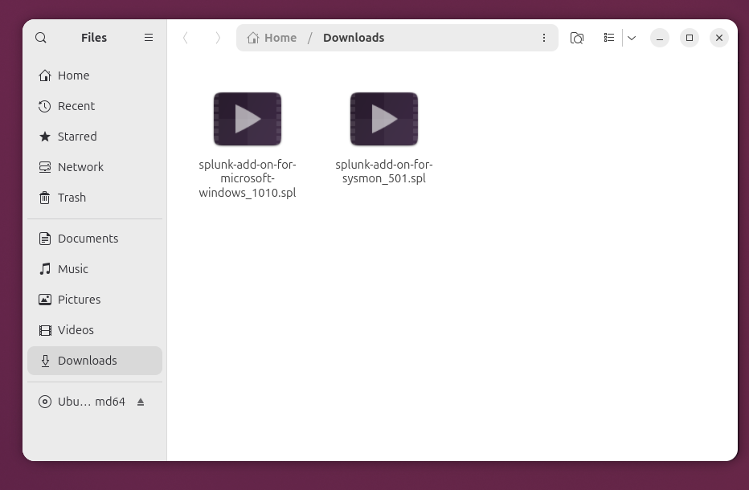
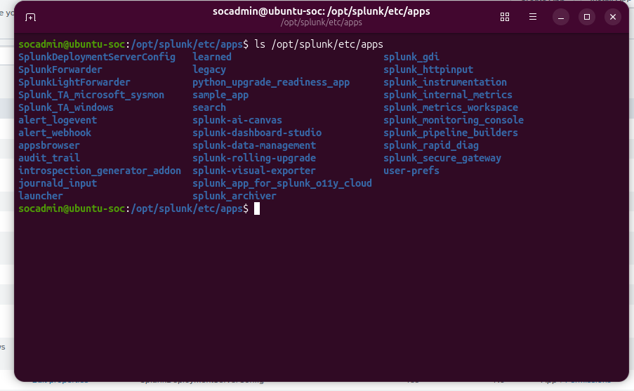
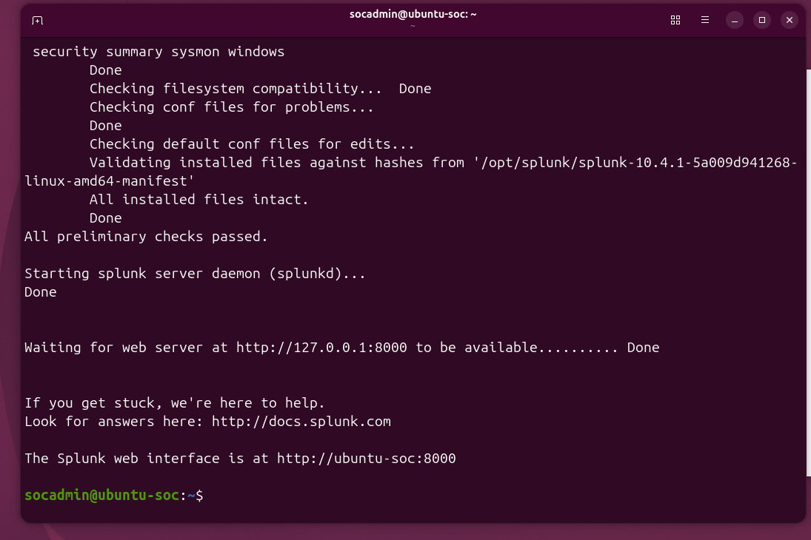
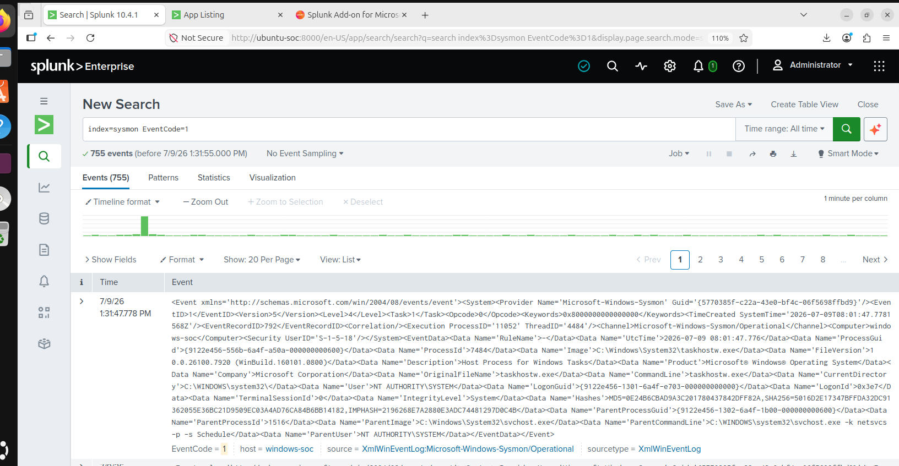
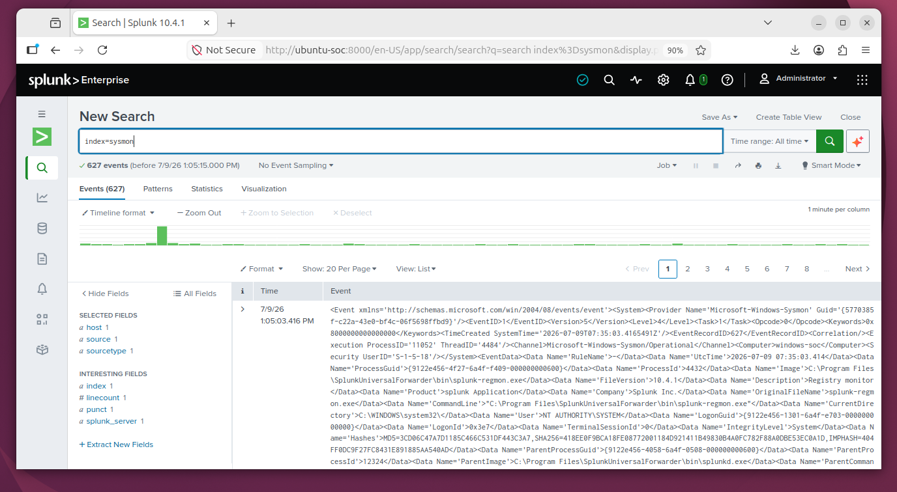

# Phase 5 – Splunk Technology Add-ons & Sysmon Parsing

## Objective

The objective of this phase is to improve Windows log parsing by installing Splunk Technology Add-ons (TAs). These add-ons provide field extractions, event normalization, CIM compatibility, and better search capabilities for Windows and Sysmon events.

After completing this phase, raw XML events are automatically parsed into meaningful fields such as:

- EventCode
- Image
- ParentImage
- ProcessGuid
- ProcessId
- User
- CommandLine
- Host
- Source
- SourceType

This significantly improves threat hunting and detection engineering within the SOC lab.

---

# Architecture

```
Windows Endpoint
        │
        │ Sysmon Events
        ▼
Splunk Universal Forwarder
        │
        │ TCP 9997
        ▼
Splunk Enterprise
        │
        ├── Splunk Add-on for Microsoft Windows
        └── Splunk Add-on for Microsoft Sysmon
                │
                ▼
      Parsed & Searchable Security Events
```

---

# Environment

| Component | Details |
|-----------|---------|
| Splunk Enterprise | Ubuntu SOC Server |
| Splunk Universal Forwarder | Windows Endpoint |
| Windows TA | Installed |
| Sysmon TA | Installed |
| Sysmon Version | v15.21 |
| Windows Version | Windows 11 |
| Network | SOC-LAB (10.10.10.0/24) |

---

# Technology Add-ons Used

## 1. Splunk Add-on for Microsoft Windows

Provides:

- Windows Event Log parsing
- CIM field mappings
- Event normalization
- Windows security knowledge objects

Installed as:

```
Splunk_TA_windows
```

---

## 2. Splunk Add-on for Microsoft Sysmon

Provides:

- Sysmon event parsing
- Process Creation fields
- Network Connection fields
- Registry Event fields
- Image Load fields
- File Creation fields

Installed as:

```
Splunk_TA_microsoft_sysmon
```

---

# Installation Procedure

## Download Technology Add-ons

Downloaded:

```
splunk-add-on-for-microsoft-windows_1010.spl
splunk-add-on-for-sysmon_501.spl
```



*Figure 1: Technology Add-on files (.spl) ready for Splunk installation.*

---

## Install Applications

Installed both applications through the Splunk Web interface.

Verified installation:

```
/opt/splunk/etc/apps/

Splunk_TA_windows
Splunk_TA_microsoft_sysmon
```



*Figure 2: Verifying installed app directories in Splunk.*

---

## Restart Splunk

Restarted Splunk Enterprise.

```bash
sudo /opt/splunk/bin/splunk restart
```



*Figure 3: Restarting the Splunk Enterprise server after app installation.*

---

# Validation

Verified that both add-ons loaded successfully.

Confirmed application directories:

```
Splunk_TA_windows

Splunk_TA_microsoft_sysmon
```

---

Verified Sysmon field extraction.

Search:

```
index=sysmon
```

Expected fields:

- host
- source
- sourcetype
- EventCode
- Image
- User
- ProcessGuid
- ParentImage
- ProcessId



*Figure 4: Automated field extraction working correctly on raw Sysmon events.*

---

Verified Process Creation events.

Search:

```
index=sysmon EventCode=1
```

Result:

Multiple Process Creation events successfully indexed.



*Figure 5: Verifying EventCode=1 process execution events in Splunk.*

---

# Benefits of Technology Add-ons

Before Installation:

- Raw XML events
- Limited searchable fields
- Difficult investigations

After Installation:

- Automatic field extraction
- Human-readable events
- CIM compatibility
- Faster investigations
- Improved detection engineering
- Better dashboards and visualizations

---

# Phase Outcome

Successfully completed:

- Installed Microsoft Windows Technology Add-on
- Installed Microsoft Sysmon Technology Add-on
- Restarted Splunk Enterprise
- Verified application installation
- Verified field extraction
- Verified Sysmon EventCode parsing
- Confirmed searchable Process Creation events

The SOC platform is now capable of efficiently parsing and analyzing Windows endpoint telemetry.

---

# Screenshots

| Screenshot | Description |
|------------|-------------|
| 01-install-splunk-ta-packages.png | Downloaded Splunk Technology Add-on packages (.spl files). |
| 02-ta-installed-in-splunk-apps-directory.png | Verified installation of Splunk_TA_windows and Splunk_TA_microsoft_sysmon in `/opt/splunk/etc/apps`. |
| 03-splunk-restart-after-ta-installation.png | Restarted Splunk Enterprise after installing the add-ons. |
| 04-sysmon-fields-extracted.png | Verified successful field extraction from Sysmon events. |
| 05-sysmon-eventcode1-results.png | Verified Process Creation (EventCode=1) events are correctly parsed and searchable. |

---

# Skills Learned

- Splunk Enterprise Administration
- Splunk App Installation
- Splunk Technology Add-ons
- Windows Event Parsing
- Sysmon Log Analysis
- Common Information Model (CIM)
- Security Log Normalization
- Threat Hunting Preparation
- Security Event Validation
- SOC Log Management

---

# Next Phase

**Phase 6 – Attack Simulation & Detection Engineering**

Activities include:

- Nmap Scanning
- Port Enumeration
- SMB Enumeration
- Service Detection
- OS Detection
- Process Creation Monitoring
- Network Connection Monitoring
- Detection Validation in Splunk