# Phase 7 – Threat Hunting & Lateral Movement

---

# Overview

Phase 7 focuses on simulating realistic post-compromise attacker activity within the SOC Home Lab. The objective is to emulate common adversary techniques used after obtaining valid credentials and to validate that Sysmon and Splunk can detect and record these activities.

Unlike the previous phase, which concentrated on reconnaissance and initial discovery, this phase emphasizes credential validation, SMB-based lateral movement, remote command execution, and threat hunting using Splunk.

---

# Objectives

The objectives of this phase were:

- Validate SMB authentication using administrative credentials.
- Enumerate administrative SMB shares.
- Simulate lateral movement using authenticated access.
- Execute remote commands using Impacket PsExec.
- Generate endpoint telemetry using Sysmon.
- Verify telemetry collection in Splunk.
- Create threat hunting queries.
- Document Indicators of Compromise (IOCs).
- Map attacker activity to the MITRE ATT&CK Framework.
- Produce professional incident reports.

---

# Lab Environment

| Machine | IP Address | Role |
|----------|------------|------|
| Ubuntu-SOC | 10.10.10.10 | Splunk Enterprise |
| Kali-SOC | 10.10.10.20 | Attack Workstation |
| Windows-SOC | 10.10.10.30 | Target Endpoint |

---

# Attack Workflow

The following attack sequence was executed during this phase:

```
Kali Linux

↓

SMB Service Discovery

↓

SMB Enumeration

↓

SMB Authentication

↓

Administrative Share Enumeration

↓

PsExec Remote Execution

↓

Remote Commands

↓

Sysmon Logging

↓

Splunk Detection

↓

Threat Hunting

↓

Incident Documentation
```

---

# Tools Used

## Offensive Tools

- Nmap
- NetExec
- smbclient
- Hydra
- Impacket PsExec

---

## Defensive Tools

- Splunk Enterprise
- Splunk Universal Forwarder
- Sysmon
- Windows Event Viewer

---

# Commands Executed

## SMB Enumeration

```bash
netexec smb 10.10.10.30
```

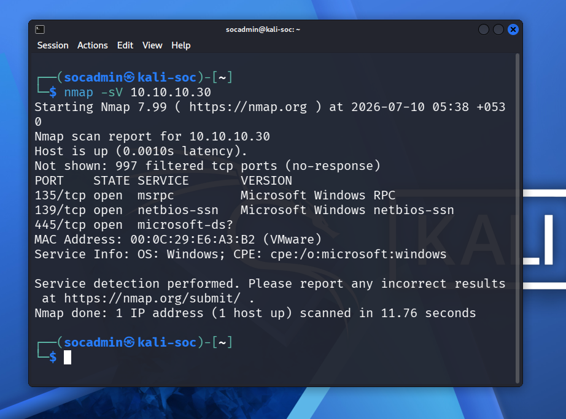
*Figure 1: Checking for open SMB service on target.*

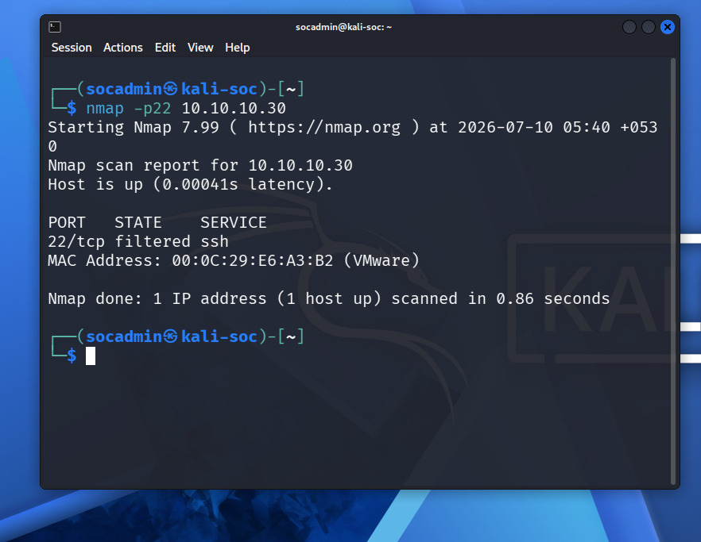
*Figure 2: Verifying SSH port status.*

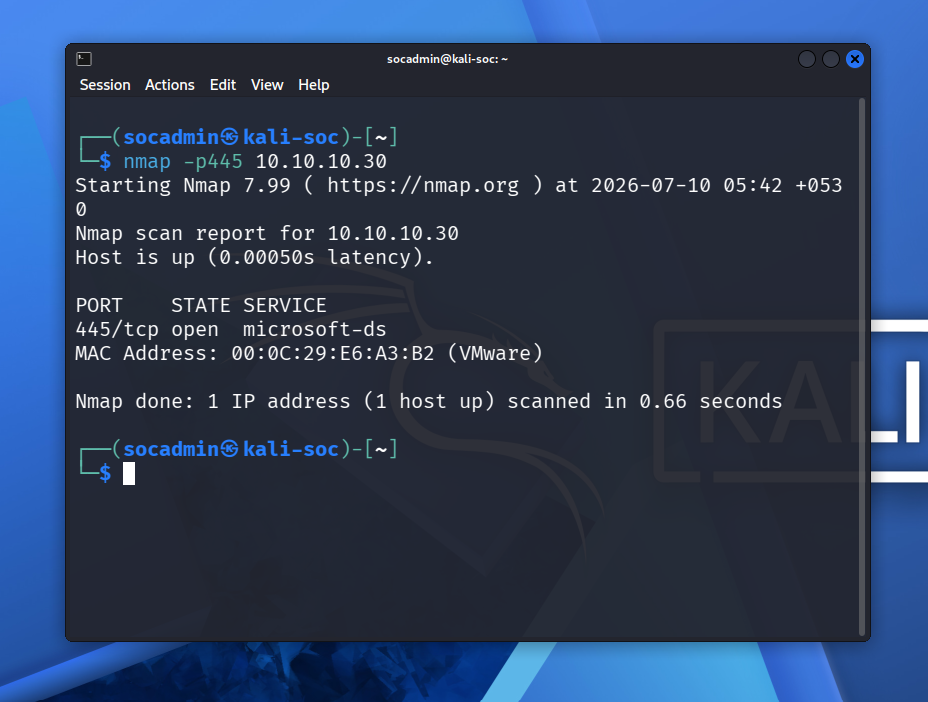
*Figure 3: Detailed SMB service checking.*

---

## SMB Authentication

```bash
netexec smb 10.10.10.30 -u socadmin -p root
```

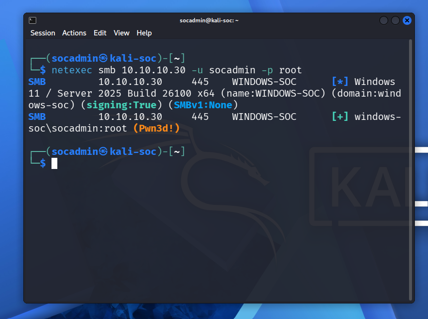
*Figure 4: Authenticated session validated using NetExec.*

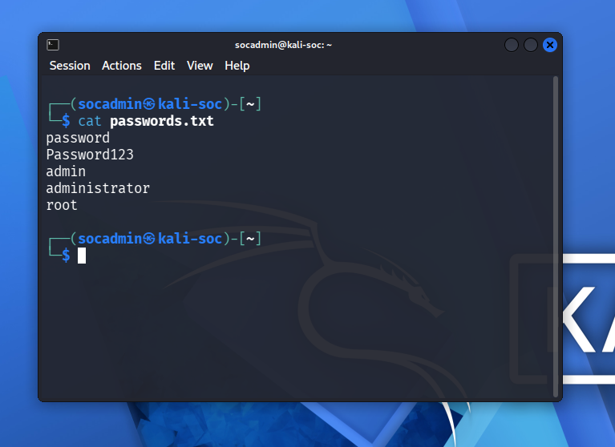
*Figure 5: Custom passwords list created for scanning.*

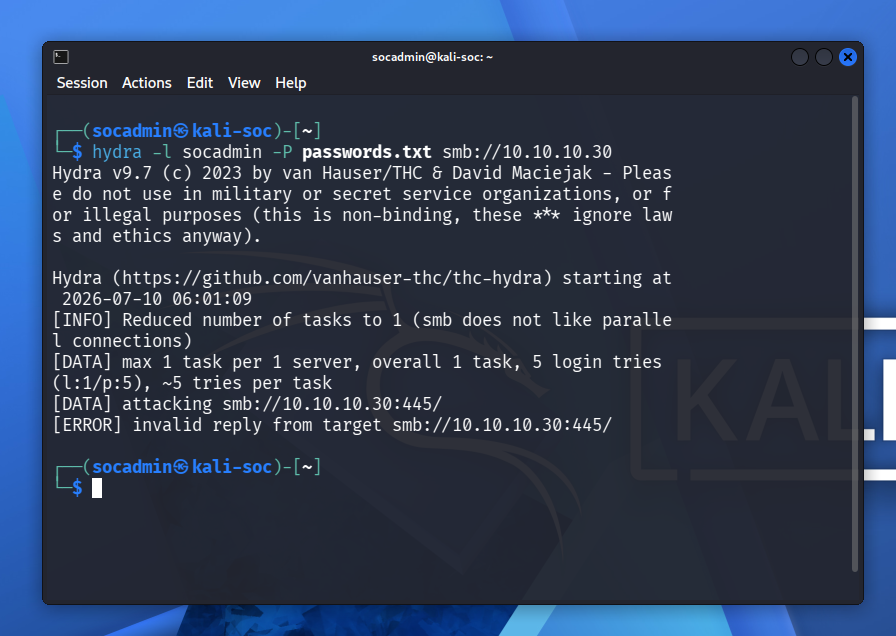
*Figure 6: Hydra executing SMB password brute-forcing.*

---

## Share Enumeration

```bash
netexec smb 10.10.10.30 -u socadmin -p root --shares
```

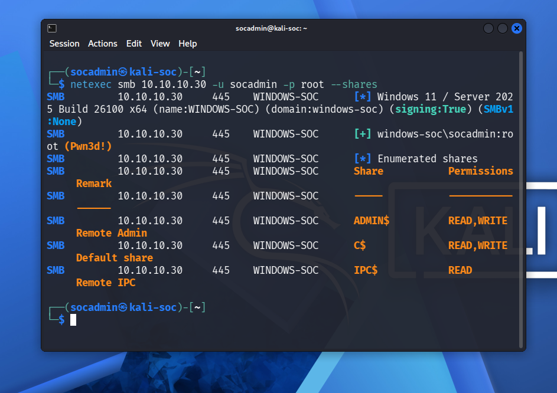
*Figure 7: Discovering available shares with administrative credentials.*

---

## smbclient

```bash
smbclient -L //10.10.10.30 -U socadmin
```

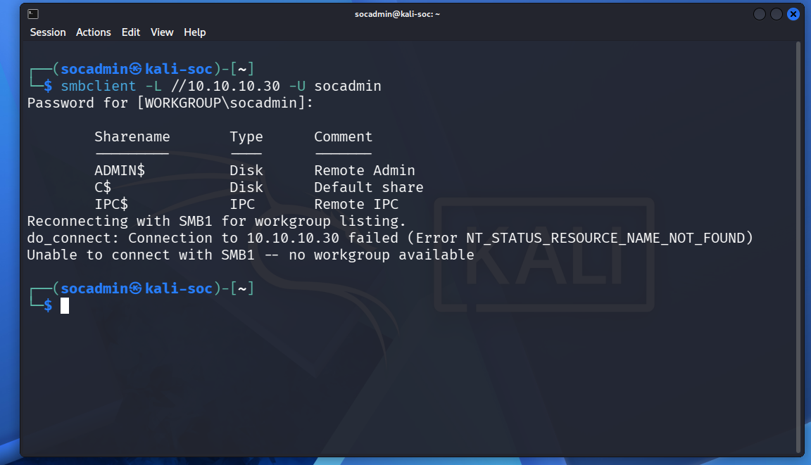
*Figure 10: Validating share permissions using smbclient.*

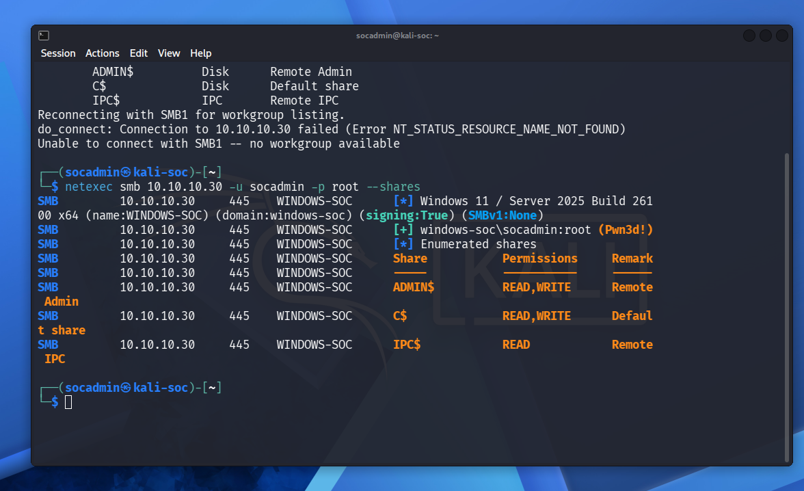
*Figure 11: NetExec output confirming administrative credentials.*

---

## PsExec

```bash
impacket-psexec WINDOWS-SOC/socadmin:root@10.10.10.30
```

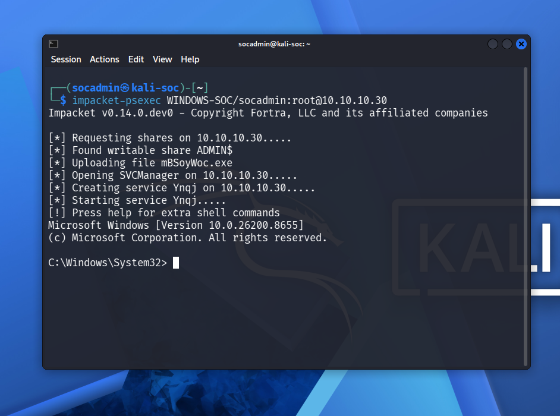
*Figure 8: Spawning an interactive SYSTEM shell on Windows using PsExec.*

---

## Remote Commands

```cmd
whoami

hostname

ipconfig

net user
```

---

# Splunk Queries

## Process Creation

```spl
index=sysmon EventCode=1
```

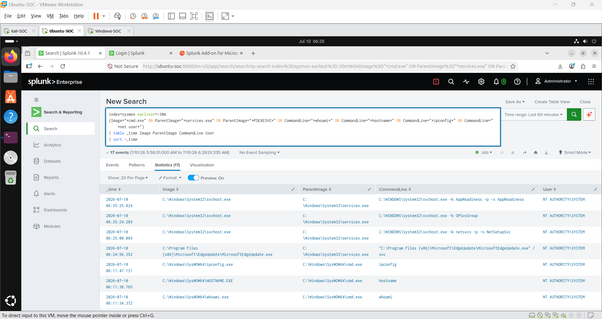
*Figure 9: Splunk query identifying administrative process creation events.*

---

## Process Timeline

```spl
index=sysmon
| table _time Image ParentImage CommandLine
```

---

## IOC Search

```spl
index=sysmon

CommandLine="*whoami*"
```

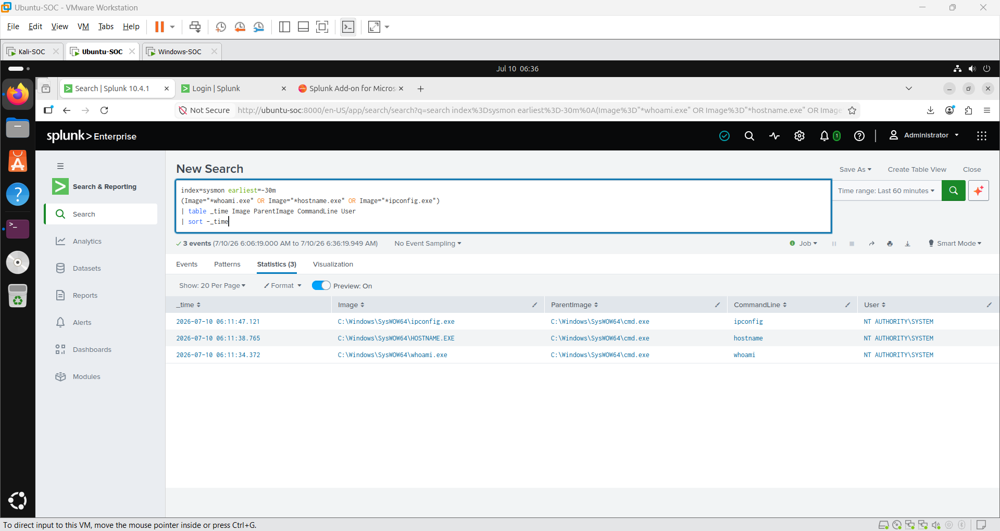
*Figure 12: Searching for malicious command executions in Splunk.*

---

## Threat Timeline

```spl
index=sysmon

| timechart count
```

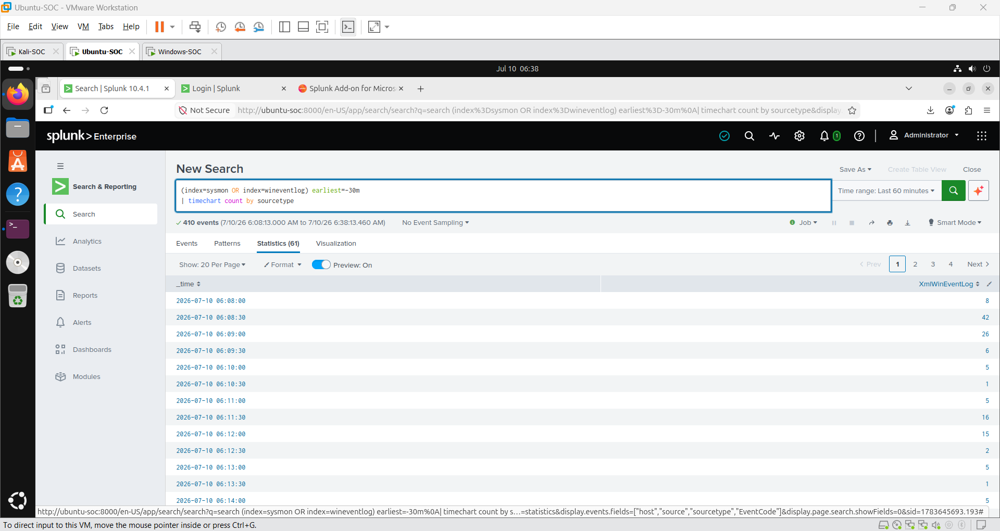
*Figure 13: Splunk chart mapping attack actions over time.*

---

# Detection Results

The following activities were successfully detected by Splunk:

- SMB Authentication
- Share Enumeration
- PsExec Execution
- Process Creation
- Remote Command Execution
- Network Connections
- Timeline Reconstruction

---

# Indicators of Compromise

## Source Host

```
10.10.10.20
```

---

## Destination Host

```
10.10.10.30
```

---

## Username

```
socadmin
```

---

## Commands

```
whoami

hostname

ipconfig

net user
```

---

## Services

Temporary PsExec service

---

## Executables

```
cmd.exe

whoami.exe

hostname.exe

ipconfig.exe
```

---

# MITRE ATT&CK Coverage

| Technique | ID |
|-----------|----|
| Network Service Discovery | T1046 |
| Valid Accounts | T1078 |
| SMB/Windows Admin Shares | T1021.002 |
| Service Execution | T1569.002 |
| Windows Command Shell | T1059.003 |
| System Owner Discovery | T1033 |
| System Information Discovery | T1082 |

---

# Threat Hunting Activities

The following hunts were completed:

- Hunt 001 – SMB Enumeration
- Hunt 002 – Network Discovery
- Hunt 003 – Remote Execution
- Hunt 004 – Process Creation
- Hunt 005 – Network Connections
- Hunt 006 – Timeline Analysis
- Hunt 007 – SMB Authentication Review
- Hunt 008 – IOC Analysis

---

# Screenshots Collected

- SMB Enumeration
- SMB Security Mode
- SMB Protocols
- SMB Authentication
- Administrative Shares
- PsExec Shell
- Sysmon Process Creation
- Splunk Detection
- Threat Hunting Queries
- Timeline Analysis

---

# Lessons Learned

During this phase several important security concepts were demonstrated:

- Valid credentials are often more valuable than software exploits.
- Administrative SMB shares provide attackers with an effective method for lateral movement.
- Sysmon Event ID 1 provides detailed visibility into process creation.
- Splunk successfully correlated endpoint telemetry with attacker actions.
- Threat hunting enables analysts to identify malicious behavior using endpoint telemetry rather than relying solely on alerts.
- Mapping activity to the MITRE ATT&CK framework improves incident classification and reporting.

---

# Challenges Encountered

- Hydra SMB module compatibility issues with modern SMB implementations.
- Windows Defender initially blocked PsExec execution.
- Windows Security Event IDs 4624 and 4625 were not forwarded to Splunk during this phase.

These issues were documented and resolved or acknowledged where appropriate.

---

# Outcome

Phase 7 successfully demonstrated the complete workflow for authenticated lateral movement, remote command execution, detection engineering, and threat hunting.

The SOC analyst was able to:

- Reproduce attacker behavior.
- Collect forensic telemetry.
- Detect malicious activity using Splunk.
- Document findings through structured incident reports.
- Map techniques to MITRE ATT&CK.

---

# Completion Status

**Status:** ✅ Complete

Phase 7 provides a comprehensive demonstration of threat hunting and lateral movement detection within the SOC Home Lab and serves as the foundation for the Incident Response activities in Phase 8.